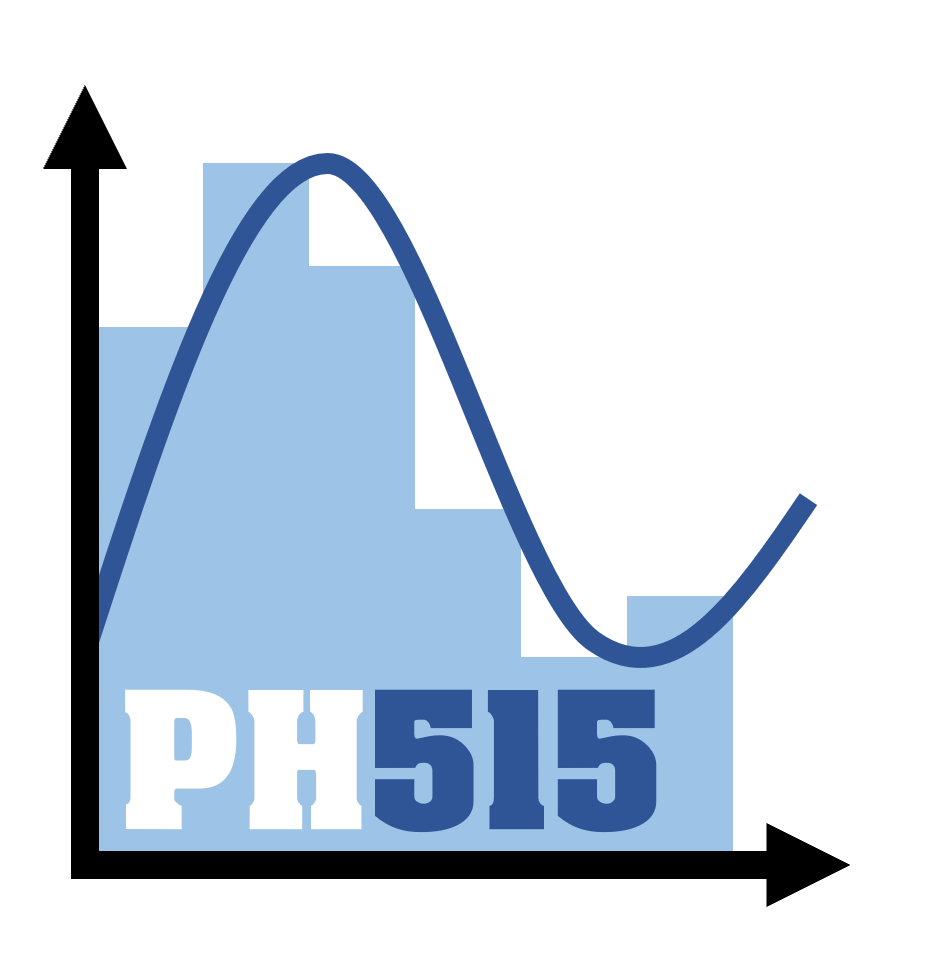

# LSPH515 : Méthodes numériques

_Cours conçu pour les étudiants de L3 de l'Université de Versailles Saint-Quentin (UVSQ)_

## Présentation du cours

En Physique, les problèmes à résoudre ne peuvent pas toujours l'être de manière analytique.
Dans les cas où une résolution analytique est difficile, voire impossible, on approximera la solution à l'aide de **méthodes numériques**.
On parle alors de "résolution numérique" d'un problème.

Une **méthode numérique** est une suite de procédures calculatoires ou d'**algorithmes**.

Vous trouverez dans ce cours des méthodes numériques pour résoudre différent problèmes classiques en Physique :

* Chapitre I : Représentation des nombres : une introduction à la représentation des nombres en machine.

* Chapitre II : Recherche de racines : un panel de méthodes pour approximer les racines d'une fonction.

* Chapitre III : Interpolation polynomiale : un panel de méthodes pour interpoler des données discrètes à l'aide d'un polynôme.

* Chapitre IV : Intégration numérique :  un panel de méthodes pour approximer l'intégrale d'une fonction.

* Chapitre V : Systèmes linéaires : un panel de méthodes pour approximer la solution d'un système linéaire d'équations.

L'objectif est qu'à la fin de ce cours vous soyez capables de :

* **Choisir* une méthode numérique adaptée à un problème donné, en se basant sur les hypothèses d'**applicabilité** des méthodes, ainsi que sur leurs **performances** (simplicité, vitesse, stabilité, coût en mémoire, etc.).

* **Implémenter** les différents algorithmes sous la forme de codes **Python**, avec des adaptations si besoin.

* **Appliquer** les méthodes numériques à un problème donné, en choisissant pertinemment les **paramètres** d'entrée de l'algorithme (valeurs initiales, conditions d'arrêt, etc.). 

---

## Credits

© Nicolas OUDART & Aymeric CHAZOTTES

_Remerciements à Alice LE GALL_