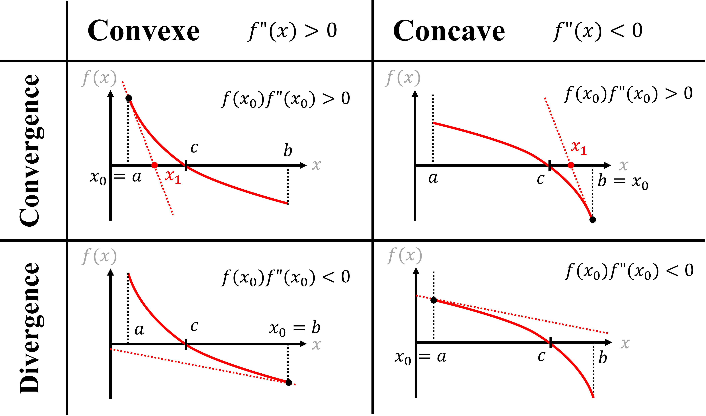
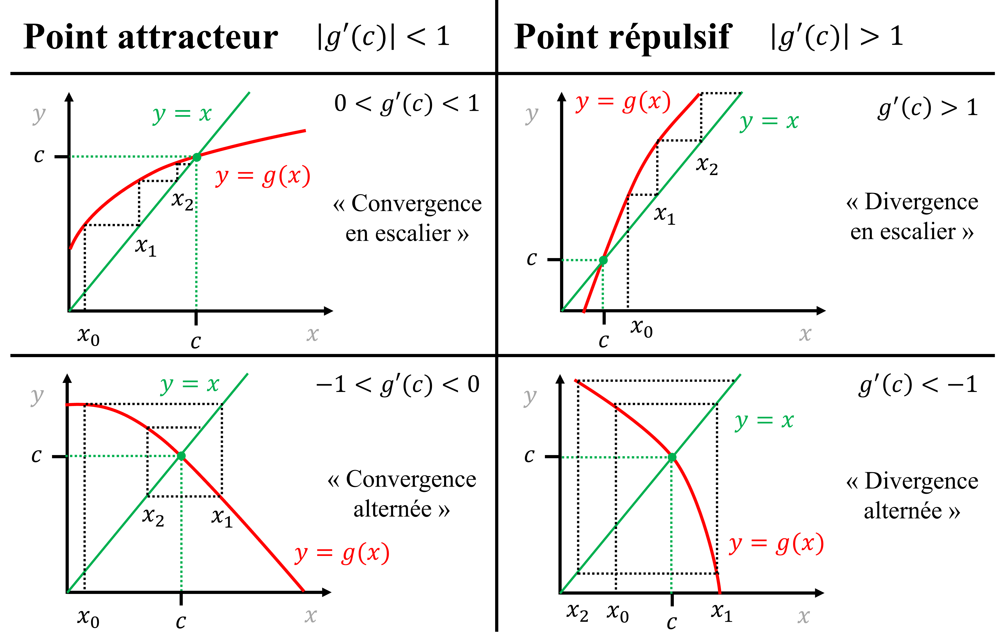

# Chapitre II : Recherche de racines

Ce chapitre porte sur les méthodes numériques pour la recherche de racines d'une fonction.

---

## Position du problème

### Motivation

|Définition|
|:-|
|Soit f une fonction définie et continue de $\mathbb{R}$ dans $\mathbb{R}$.|
|Les **racines** ou **zéros** de cette fonction sont les valeurs $x$ qui vérifient l'équation $f(x)=0$|

Le principal intérêt des méthodes de recherche de racines est de pouvoir **résoudre des équations**.
En effet, trouver $x \in \mathbb{R}$ tel que $f(x)=c$ revient à chercher les racines de la fonction $f(x)-c$.

Dans certains cas, on peut trouver analytiquement les racines d'une fonction.  

Toute équation polynomiale de degré $n$ a exactement $n$ solutions dans $\mathbb{C}$ et au plus $n$ solutions dans $\mathbb{R}$.
Mais d'après la théorie d'Evariste Galois, **à partir du degré 5 il n'existe plus de formule générale de résolution**.

Si l'équation n'est pas polynomiale, sa résolution analytique est encore moins probable.

D'où l'intérêt d'utiliser des **méthodes de résolution numériques**, afin d'approcher les valeurs des racines.

Le principe est le suivant :

* Localiser grossièrement les racines en procédant à des évaluations graphiques.

* Construire une suite qui converge vers chaque racine.

**Ce chapitre présentera un panel de méthodes numériques de recherche de racines**, que nous appliquerons à un même exemple pour illustration.

### Existence et localisation des racines

Que l'approche soit analytique ou numérique, la 1ère étape consiste généralement à localiser les solutions de l'équation.

Pour ce faire, on détermine les intervalles $[a,b]$ contenant une unique **racine**.
C'est ce que l'on appelle la **séparation des racines**.

Cette détermination se fait graphiquement et/ou analytiquement de la manière suivante :

* Etude des variations de la fonction $f$.

* Trouver les intervalles ne contenant qu'une seule racine en s'appuyant sur les théorèmes suivant.

|Théorème des valeurs intermédiaires|
|:-|
|Soit $f$ une fonction continue sur un intervalle $I=[a,b]$ de $\mathbb{R}$.|
|$f$ atteint toutes les valeurs intermédiaires entre $f(a)$ et $f(b)$. Autrement dit :|
|- Si $f(a) \leq f(b)$ alors pour tout $d \in [f(a),f(b)]$ il existe un $c \in [a,b]$ tel que $f(c)=d$.|
|- Si $f(a) \geq f(b)$ alors pour tout $d \in [f(b),f(a)]$ il existe un $c \in [a,b]$ tel que $f(c)=d$.|

D'où le corollaire :

|Théorème de Bolzano|
|:-|
|Soit une fonction continue $f:[a,b] \longrightarrow \mathbb{R}$| 
|Si $f(a)f(b)<0$ alors il existe au moins un $c \in ]a,b[$ tel que $f(c)=0$.|

Le théorème de Bolzano garantit l'existence d'au moins une racine **mais pas son unicité** dans $[a,b]$.

Pour assurer l'unicité d'une racine dans $[a,b]$, on essaiera d'appliquer le **théorème de la bijection** avec le **théorème des valeurs intermédiaires**.

|Théorème de la bijection + Théorème des valeurs intermédiaires|
|:-|
|Soit $f$ une fonction continue et **strictement monotone** sur $I=[a,b]$ de $\mathbb{R}$|
|alors $f$ induit une bijection de $I$ dans $f(I)$.|
|Si de plus $f(a)f(b)<0$|
|alors il existe un **unique** $c \in ]a,b[$ tel que $f(c)=0$.|
|Autrement dit, la fonction $f$ s'annule une seule fois dans $]a,b[$.|

L'étude préalable de la fonction doit donc avoir pour but de séparer les racines en isolant des intervalles sur lesquels la fonction est **strictement monotone** et **change de signe**.

### Méthodes numériques et convergence

Comme évoqué précédemment, l'idée est d'approximer la racine d'une fonction lorsque l'on est incapables de trouver la solution analytiquement.

Les méthodes numériques de recherche de racines sont en général des méthodes **itératives**.

Il s'agit de construire une suite $x_{n+1} = g(x_n)$ telle que $\lim\limits_{n \to \infty} x_n = c$ où $c$ est la racine à approcher.

La performance de ces méthodes est évaluée par leur **vitesse de convergence** :

|Définition|
|:-|
|Soit $c$ la racine recherchée. Posons $e_n = x_n - c$ l'**erreur absolue** à l'itération $n$.|
|La suite est dite **convergente d'ordre $p \geq 1$** si|
|il existe une constante $K>0$ et un indice $n_0 \geq 1$ tels que $\forall n \geq n_0$ :| 
|$\lim\limits_{n \to \infty} \frac{\mid e_{n+1} \mid}{\mid e_n \mid^p} \leq K$|

La convergence est d'autant plus rapide que la valeur de $p$ est grande.
$K$ est le **facteur de convergence** de la suite.

Voici comment on qualifie la convergence en fonction de $p$ et $K$ :

|Valeur de $p$|Valeur de $K$|Convergence                     |
|:------------|:-----------:|-------------------------------:|
|$1$          |$0$          |Super-linéaire                  |
|$1$          |$]0,1[$      |Linéaire                        |
|$1$          |$1$          |Logarithmique                   |
|$1$          |$>1$         |Sous-linéaire (non-convergence) |
|$2$          |             |Quadratique                     |
|$3$          |             |Cubique                         |
|$4$          |             |Quadratique                     |

Dans la pratique, la racine étant inconnue, **nous ne pouvons pas calculer l'erreur** $e_n$.

C'est pourquoi, à chaque itération, on calcule plutôt le **résidu** $r_n = f(x_n)$.

On considère que la suite est suffisamment proche de la racine si $r_n < \varepsilon$ avec $\varepsilon$ la précision choisie.

La convergence des méthodes itératives de recherche de racines dépend en général du choix de la donnée initiale $x_0$ :

* Une méthode qui converge quelque soit $x_0$ est dite **globalement convergente**.

* Une méthode qui converge seulement lorque $x_0$ est au voisinage de la racine est dite **localement convergente**.

De manière générale, les méthodes localement convergentes on un ordre de convergence plus grand que les méthodes globalement convergentes.

### Exemple de problème

Au cours de ce chapitre, nous appliquerons les différentes méthodes numériques de recherche de racines à un même exemple : **l'estimation de $\sqrt{2}$**.

$\sqrt{2}$ est un nombre irrationel, dont l'approximation est un problème depuis l'antiquité, notamment parce qu'il correspond à l'hypothénuse d'un carré de côté 1.
Une valeur approchée de $\sqrt{2}$ à $10^{-9}$ près est : 1.414213562.

Par définition, $\sqrt{2}$ et $-\sqrt{2}$ sont les solutions de l'équation $x^2 = 2$.

Résoudre cette équation revient à résoudre $x^2 - 2 = 0$.

Pour calculer une approximation de $\sqrt{2}$, on peut donc chercher les racines de la fonction **$f(x) = x^2 - 2$** de $\mathbb{R}$ dans $\mathbb{R}$.

La voici sous la forme d'une fonction Python :

~~~
def f(x):

	return (x**2)-2
~~~

Cette fonction est continue et dérivable sur $\mathbb{R}$, et sa dérivée est $f'(x) = 2x$. On peut en déduire ses variations :

* Théorème de la bijection : $f$ est continue et strictement monotone sur $I=[1,2]$, donc $f$ induit une bijection de $I$ dans $f(I)$.

* Théorème des valeurs intermédiaires : $f(1)=-1$ et $f(2)=2$, d'où $f(1)f(2)<0$.

Donc, il existe une seule racine de $f$ dans $]1,2[$, et nous savons que cette racine est $\sqrt{2}$.

C'est pourquoi dans la suite de ce chapitre, sauf indication contraire, nous chercherons la racine de $f$ se trouvant sur l'intervalle $]1,2[$.

---

## Méthode de la dichotomie

### Algorithme

La méthode de la **dichotomie** est inspirée du théorème des valeurs intermédiaires.
Elle est aussi connue sous le nom de **"méthode de la bissection"**.

Soit $f$ une fonction continue de $[a,b]$ dans $\mathbb{R}$.
On suppose que $f$ admet une unique racine dans $]a,b[$ et que $f(a)f(b)<0$.

Voici l'algorithme sous la forme d'une fonction Python.

Elle prend en entrée :

* `f` la fonction dont on cherche les racines.

* `a` et `b` les bornes de l'intervalle de recherche.

* `n_max` le nombre maximum d'itérations.

* `e` la précision désirée.

On notera les variables à l'itération `n` : 

* `x_n` l'estimation de la racine.

* `a_n` et `b_n` les bornes de l'intervalle de recherche.

* `r_n` le résidu.

~~~
def dichotomie(f,a,b,n_max,e):

	#Initialisation des variables :
	n = 0 #Nombre d'itérations
	x_n = (a+b)/2 #Estimation de la racine
	a_n = a #Borne inférieure de l'intervalle de recherche
	b_n = b #Borne supérieure de l'intervalle de recherche
	r_n = f(x_n) #Résidu
	
	#Itérations de l'algorithme de dichotomie
	#tant qu'une des conditions d'arrêt n'est pas atteinte :
	while (n<n_max)and(abs(a_n-b_n)>e)and(abs(r_n)>e):
	
		#Si la racine est dans ]a_n,x_n[ alors on remplace b_n par x_n:
		if (f(a_n)*f(x_n))<0:
			b_n = x_n
		
		#Si la racine est dans ]x_n,b_n[ alors on remplace a_n par x_n:
		if (f(x_n)*f(b_n))<0:
			a_n = x_n
		
		#Incrémenter le nombre d'itérations :
		n+=1
		
		#Mettre à jour l'estimation de la racine et le résidu :
		x_n = (a_n+b_n)/2 
		r_n = f(x_n)
	
	#Renvoyer l'estimation de la racine et le résidu :
	return x_n,r_n
~~~

### Convergence

La longueur de l'intervalle de recherche est divisée par 2 à chaque itération :

$I_n = \mid b_n-a_n \mid = \frac{\mid b-a \mid}{2^n}$

Donc, l'erreur absolue à l'itération $n \geq 0$, $e_n=x_n-c$

$\mid e_n \mid \leq \frac{I_n}{2} = \frac{\mid b-a \mid}{2^{n+1}}$

Ce qui entraine : $\lim\limits_{n \to \infty} \mid e_n \mid = 0$
et $\frac{\mid e_{n+1} \mid}{\mid e_n \mid} \leq \frac{1}{2}$

La méthode de la dichotomie est donc **globalement convergente** : elle converge quelque soit le point de départ.
(Si la $f$ a plusieurs racines dans $[a,b]$, la racine trouvée dépendra de l'intervalle).

Sa convergence est **linéaire**, donc elle est relativement **lente**.
C'est pourquoi on utilise souvent cette méthode juste pour initialiser une méthode plus rapide.

### Précision

En fonction de la précision souhaitée $\varepsilon$, on peut calculer le nombre d'itérations $m$ pour approcher la racine.

On cherche $m \in \mathbb{N}$ tel que :
$\mid e_{m-1} \mid \leq \frac{\mid b-a \mid}{2^m} \leq \varepsilon$

Donc tel que :
$2^m \geq \frac{\mid b-a \mid}{\varepsilon}$

Soit : 
$m \geq log_2{\frac{\mid b-a \mid}{\varepsilon}} = \frac{ln{\frac{\mid b-a \mid}{\varepsilon}}}{ln(2)} \approx 1.4427 ln{\frac{\mid b-a \mid}{\varepsilon}}$

### Exemple

Voici les 4 premières itérations de la méthode de la dichotomie appliquée à notre problème exemple, pour un intervalle initial $[1,2]$ :

**Exercice :**

En adaptant la fonction Python donnée précédemment pour la méthode de la dichotomie, avec un intervalle initial $[1,2]$, estimez la valeur de $\sqrt{2}$ avec une précision de $10^{-6}$.
Combien d'itérations sont nécessaires pour obtenir cette précision ? Retrouvez-vous bien le nombre d'itérations théorique ?

---

## Avant-propos : les méthodes linéarisées

Les méthodes qui seront présentées dans la suite de ce chapitre sont des **méthodes linéarisées**.
Ce type de méthodes s'appuit sur le dévloppement de Taylor de $f$ autour de sa racine $c$ :

$f(c) = 0 = f(x') + (c-x')f'(\xi)$ où $\xi \in [x',c]$ et $f(x') \neq 0$

D'où $c = x' - \frac{f(x')}{f'(\xi)}$

Donc, si on connait $\xi$, on peut déterminer $c$ à partir de $x'$.

D'un point de vue géométrique, la racine $c$ est à l'intersection entre la droite passant par le point $(x',f'(x'))$ et de pente $f'(\xi)$ et donc d'équation :

$y = f'(\xi) x + f(x') - f'(\xi) x'$

et l'axe $(Ox)$ donc d'équation $y = 0$.

{width="350"}

D'où la méthode itérative suivante :

$f(x_n) + (x_{n+1} - x_n) q_n = 0$

ou encore l'**équation de récurrence** :

$x_{n+1} = x_n - \frac{f(x_n)}{q_n}$

où $q_n$ est une approximation de $f'(\xi)$.

L'idée des méthodes linéarisées est donc :

* D'approcher une fonction non-linéaire par une droite.

* Déterminer à chaque itération $x_{n+1}$ comme l'intersection entre l'axe $(Ox)$ et la droite de pente $q_n$ passant par le point $(x_n,f(x_n))$.

Les méthodes linéarisées (méthode de la sécante, méthode de la fausse position, méthode de Newton, etc.) se différentient par **le choix de $q_n$**.

---

## Méthode de la sécante

### Algorithme

La **méthode de la sécante** est une méthode linéarisée pour laquelle :

$q_n = \frac{f(x_n)-f(x_{n-1})}{x_n-x_{n-1}}$

Cette suite correspond à la droite passant par les points $(x_n,f(x_n))$ et $(x_{n-1},f(x_{n-1}))$.

Soit $f$ une fonction continue de $[a,b]$ dans $\mathbb{R}$.
On suppose que $f$ admet une unique racine dans $]a,b[$ et que $f(a)f(b)<0$.

Voici l'algorithme sous la forme d'une fonction Python.

Elle prend en entrée :

* `f` la fonction dont on cherche les racines.

* `a` et `b` les bornes de l'intervalle de recherche.

* `n_max` le nombre maximum d'itérations.

* `e` la précision désirée.

On notera les variables à l'itération `n` : 

* `x_n` l'estimation de la racine à l'itération n.

* `x_n_old` l'estimation de la racine à l'itération n-1.

* `r_n` le résidu.

~~~
def secante(f,a,b,n_max,e):

	#Initialisation des variables :
	n = 1 #Nombre d'itérations
	x_n = a #Estimation de la racine à l'itération n
	x_n_old = b #Estimation de la racine à l'itération n-1
	r_n = f(x_n) #Résidu
	
	#Itérations de l'algorithme de la sécante
	#tant qu'une des conditions d'arrêt n'est pas atteinte :
	while (n<n_max)and(abs(x_n-x_n_old)>e)and(abs(r_n)>e):
	
		#Calculer la pente de la droite : 
		q_n = (f(x_n)-f(x_n_old))/(x_n-x_n_old)
		
		#Mettre à jour l'estimation de la racine :
		x_n_old = x_n #Iteration n
		x_n = x_n - f(x_n)/q_n #Iteration n+1
		
		#Incrémenter le nombre d'itérations :
		n+=1
		
		#Mettre à jour le résidu :
		r_n = f(x_n)
		
	#Renvoyer l'estimation de la racine et le résidu :
	return x_n,r_n
~~~

### Convergence

La méthode de la sécante est **convergente localement**.

Si les données initiales sont assez proches de la racine $c$, et que $f'(c) \neq 0$, alors on peut démontrer qu'elle converge avec un ordre $p = \frac{1+\sqrt(5)}{2}$.
Cette valeur est connue sous le nom de "nombre d'or".

### Exemple

Voici les 5 premières itérations de la méthode de la sécante appliquée à notre problème exemple.
L'intervalle initial est ici de [0,2] pour des raisons de lisibilité :

**Exercice :**

En adaptant la fonction Python donnée précédemment pour la méthode de la sécante, avec un intervalle initial $[1,2]$, estimez la valeur de $\sqrt{2}$ avec une précision de $10^{-6}$.
Combien d'itérations sont nécessaires pour obtenir cette précision ? Comparez cette valeur à celle obtenue pour la méthode de la dichotomie.

---

## Méthode de la fausse position

### Algorithme

La **méthode de la fausse position** est une méthode linéarisée pour laquelle :

$q_n = \frac{f(x_n)-f(x_n')}{x_n-x_n'}$

Cette suite correspond à la droite passant par les points $(x_n,f(x_n))$ et $(x_n',f(x_n'))$, où $n'$ est le plus grand indice inférieur à $n$ tel que $f(x_n)f(x_n')<0$.

Il s'agit d'un mélange entre la méthode de la dichotomie et la méthode de la sécante.
On l'appelle aussi **méthode de regula falsi** ou **méthode de Lagrange**.

Soit $f$ une fonction continue de $[a,b]$ dans $\mathbb{R}$.
On suppose que $f$ admet une unique racine dans $]a,b[$ et que $f(a)f(b)<0$.

Voici l'algorithme sous la forme d'une fonction Python.

Elle prend en entrée :

* `f` la fonction dont on cherche les racines.

* `a` et `b` les bornes de l'intervalle de recherche.

* `n_max` le nombre maximum d'itérations.

* `e` la précision désirée.

On notera les variables à l'itération `n` : 

* `x_n` l'estimation de la racine.

* `a_n` et `b_n` les bornes de l'intervalle de recherche.

* `r_n` le résidu.

~~~
def fausse_position(f,a,b,n_max,e):

	#Initialisation des variables :
	n = 0 #Nombre d'itérations
	a_n = a #Borne inférieure de l'intervalle de recherche
	b_n = b #Borne supérieure de l'intervalle de recherche
	q_n = (f(b_n)-f(a_n))/(b_n-a_n) #Initialiser la pente de la droite
	x_n = a_n-f(a_n)/q_n #Estimation de la racine
	r_n = f(x_n) #Résidu
	
	#Itérations de l'algorithme de la fausse-position
	#tant qu'une des conditions d'arrêt n'est pas atteinte :
	while (n<n_max)and(abs(a_n-b_n)>e)and(abs(r_n)>e):
	
		#Si la racine est dans ]a_n,x_n[ alors on remplace b_n par x_n:
		if (f(a_n)*f(x_n))<0:
			b_n = x_n
		
		#Si la racine est dans ]x_n,b_n[ alors on remplace a_n par x_n:
		if (f(x_n)*f(b_n))<0:
			a_n = x_n
	
		#Incrémenter le nombre d'itérations :
		n+=1
		
		#Calcul de la nouvelle pente de la droite :
		q_n = (f(b_n)-f(a_n))/(b_n-a_n)
	
		#Mettre à jour l'estimation de la racine et le résidu :
		x_n = x_n-f(x_n)/q_n
		r_n = f(x_n)
	
	#Renvoyer l'estimation de la racine et le résidu :
	return x_n,r_n
~~~

### Convergence

La méthode de la fausse position est **globalement convergente** :

* Si $f$ est à concavité constante avec $f"<0$ (concave), la suite converge vers la racine en croissant.

* Si $f$ est à concavité constante avec $f">0$ (convexe), la suite converge vers la racine en décroissant.

Elle converge avec un ordre $p$ d'au moins 1 de façon **super-linéaire**.

### Exemple

Voici les 5 premières itérations de la méthode de la fausse position appliquée à notre problème exemple.
L'intervalle initial est ici de [0,2] pour des raisons de lisibilité :

**Exercice :**

En adaptant la fonction Python donnée précédemment pour la méthode de la fausse position, avec un intervalle initial $[1,2]$, estimez la valeur de $\sqrt{2}$ avec une précision de $10^{-6}$.
Combien d'itérations sont nécessaires pour obtenir cette précision ? Comparez cette valeur à celle obtenue pour la méthode de la sécante.

---

## Méthode de Newton

### Algorithme

La **méthode de Newton** est une méthode linéarisée pour laquelle :

$q_n = f'(x_n)$

Cette suite correspond à la pente de la tangente à la fonction $f$ en $x_n$.

On l'appelle aussi la **méthode de Newton-Raphson**.
Cette méthode nécessite l'évaluation de $f$ et de sa dérivée $f'$.
Dans le cas de notre problème exemple, on définira :

~~~
def f_derivee(x):

	return 2*x
~~~

Soit $f$ une fonction continue de $[a,b]$ dans $\mathbb{R}$.
On suppose que $f$ admet une unique racine dans $]a,b[$ et que $f(a)f(b)<0$.
On choisi d'initialiser la méthode avec $x_0 \in [a,b]$.

Voici l'algorithme sous la forme d'une fonction Python.

Elle prend en entrée :

* `f` la fonction dont on cherche les racines.

* `f_derivee` la dérivée de la fonction dont on cherche les racines.

* `x_0` point de départ de la recherche.

* `n_max` le nombre maximum d'itérations.

* `e` la précision désirée.

On notera les variables à l'itération `n` : 

* `x_n` l'estimation de la racine à l'itération n.

* `x_n_old` l'estimation de la racine à l'itération n-1.

* `r_n` le résidu.

~~~
def newton(f,f_derivee,x_0,n_max,e):

	#Vérifier que le point de départ de la recherche est possible :
    if f_derivee(x_0)==0:
        raise ValueError("Mauvaise initialisation, f'(x_0) = 0")

	#Initialisation des variables :
	n = 0 #Nombre d'itérations
	x_n_old = x_0 #Estimation de la racine à l'itération n-1
	x_n = x_n_old-f(x_n_old)/f_derivee(x_n_old) #Estimation de la racine à l'itération n
	r_n = f(x_n) #Résidu
	
	#Itérations de l'algorithme de Newton
	#tant qu'une des conditions d'arrêt n'est pas atteinte :
	while (n<n_max)and(abs(x_n-x_n_old)>e)and(abs(r_n)>e):
	
		#Mettre à jour l'estimation de la racine :
		x_n_old = x_n #Itération n
		x_n = x_n-f(x_n)/f_derivee(x_n) #Iteration n+1
		
		#Incrémenter le nombre d'itérations :
		n+=1
		
		#Mettre à jour le résidu :
		r_n = f(x_n)

	#Renvoyer l'estimation de la racine et le résidu :
	return x_n,r_n
~~~

### Convergence

La méthode de Newton est **convergente localement**.

Si $x_0$ est assez proche de la racine $c$, et $f'(c) \neq 0$, on peut montrer que la méthode converge avec un ordre $p=2$.
La convergence est donc **quadratique**.

En pratique, on utilise souvent la méthode de la dichotomie pour trouver un point de départ $x_0$ suffisamment proche de $c$ avant d'utiliser la méthode de Newton.

Reste un incovénient, la méthode de Newton nécessite le calcul de dérivées, et est donc plus coûteuse en calcul.

La méthode de Newton est **sûrement convergente** dans le cas d'une fonction $f$ strictement monotone et ne présentant pas de points d'inflexion dans l'intervalle $[a,b]$ (i.e. $f"(x)$ ne change pas de signe donc $f$ a une concavité constante) si le point de départ $x_0$ est tel que :

**$f(x_0)f"(x_0)>0$**

Pour choisir un point de départ $x_0$ qui ne risque pas de faire diverger la méthode de Newton, il faut donc s'assurer de respecter cette condition.

### Exemple

Voici les 4 premières itérations de la méthode de Newton appliquée à notre problème exemple.
Le point de départ de la recherche choisi est de 2.5 pour des raisons de lisibilité :

On note que le choix de point de départ est correct, car $f$ est à concavité constante positive ($f"(x)=2>0$) et $f(x_0)=4.25>0$, ce qui signifie que $f(x_0)f"(x_0)>0$ est bien respectée.

**Exercice :**

En adaptant la fonction Python donnée précédemment pour la méthode de Newton, avec un point de départ de votre choix, estimez la valeur de $\sqrt{2}$ avec une précision de $10^{-6}$.
Combien d'itérations sont nécessaires pour obtenir cette précision ? Comparez cette valeur à celle obtenue pour les méthodes précédentes. Quelle est la méthode linéarisée la plus rapide ?

NB: La méthode de Newton appliquée au cas de l'estimation de $\sqrt{2}$ est un cas particulier de la célèbre méthode d'Héron d'Alexandrie.

---

## Méthode du point fixe

### Définitions

|Idée|
|:-|
|Transformer l'équation $f(x)=0$ en une équation équivalente $g(x)=x$ où $g$ est une fonction auxiliaire bien choisie.|
|La racine $c$ est alors un **point fixe** de $g$ et approcher les zéros de $f$ revient à approcher les points fixes de $g$.|

Cette transformation est **toujours possible** mais **pas unique**.

Dans la pratique, la méthode du point fixe consiste à transformer le problème $f(x)=0$ où $f:[a,b] \rightarrow \mathbb{R}$ en un problème équivalent $x=g(x)$, en passant par un **schéma itératif** $x_{n+1}=g(x_n)$ où $g$ est une fonction bien choisie.
L'itération est dite **de point fixe**, et la fonction $g$ est la **fonction d'itération** associée.

|Théorème du point fixe|
|:-|
|Soit $g$ une fonction continue et $(x_n)$ une suite générée par l'itération de point fixe $x_{n+1}=g(x_n)$.|
|Si $\lim\limits_{n \to \infty} x_n = c$ alors par continuité de $g$ :|
|$\lim\limits_{n \to \infty} g(x_n) = g(c) = c$|
|Donc $c$ est un point fixe de $g$.|

**Les méthodes linéarisées sont des méthodes de point fixe** : on obtient $x_{n+1}$ à partir de $x_n$ en évaluant toujours la même expression $x_{n+1}=g(x_n)$.

Par exemple, dans notre problème de l'approximation de $\sqrt{2}$, résoudre $x^2-2=0$ revient à trouver le point fixe de $g(x)=x-\frac{f(x)}{f'(x)}=\frac{x+\frac{2}{x}}{2}$.

### Algorithme

Soit $f$ une fonction continue de $[a,b]$ dans $\mathbb{R}$.
On suppose que $f$ admet une unique racine dans $]a,b[$ et que $f(a)f(b)<0$.
On choisi d'initialiser la méthode avec $x_0 \in [a,b]$.

Cette méthode nécessite la sélection d'une fonction d'itération de point fixe $g$.
Dans le cas de notre problème exemple, on pourra choisir :

~~~
def g(x):

	return x/2+1/x
~~~

Voici l'algorithme sous la forme d'une fonction Python.

Elle prend en entrée :

* `f` la fonction dont on cherche les racines.

* `g` la fonction d'itération choisie.

* `x_0` point de départ de la recherche.

* `n_max` le nombre maximum d'itérations.

* `e` la précision désirée.

On notera les variables à l'itération `n` : 

* `x_n` l'estimation de la racine à l'itération n.

* `x_n_old` l'estimation de la racine à l'itération n-1.

* `r_n` le résidu.

~~~
def point_fixe(f,g,x_0,n_max,e):

	#Initialisation des variables :
    n = 0 #Nombre d'itérations
    x_n_old = x_0 #Estimation de la racine à l'itération n-1
    x_n = g(x_n_old) #Estimation de la racine à l'itération n
    r_n = f(x_n) #Résidu
	
	#Itérations de l'algorithme du point fixe
	#tant qu'une des conditions d'arrêt n'est pas atteinte :
    while (n<n_max)and(abs(x_n-x_n_old)>e)and(abs(r_n)>e):
	
		#Mettre à jour l'estimation de la racine :
        x_n_old = x_n #Itération n
        x_n = g(x_n) #Iteration n+1
		
		#Incrémenter le nombre d'itérations :
        n+=1
		
		#Mettre à jour le résidu :
        r_n = f(x_n)

	#Renvoyer l'estimation de la racine et le résidu :
    return x_n,r_n
~~~

### Convergence

|Théorème de la convergence globale des itérations de point fixe|
|:-|
|Soit $g$ une fonction continue de $[a,b]$ dans $\mathbb{R}$.|
|**1. Hypothèse d'inclusion (ou de stabilité) :**|
|Si $\forall x \in [a,b]$, $g(x) \in [a,b]$ alors $g$ admet un point fixe dans $[a,b]$.|
|**2. Hypothèse de contraction stricte :**|
|Si de plus, $\exists K \in ]0,1[$ tel que $\mid g(x)-g(y) \mid \leq K \mid x-y \mid \forall x,y \in [a,b]$|
|(on dit que $g$ est **strictement contractante**)|
|alors $g$ admet un point fixe **unique** noté $c$ dans $[a,b]$|
|et la suite $x_{n+1}=g(x_n)$ converge vers $c$ **pour toute valeur de départ $x_0$ dans $[a,b]$**.|
|On appelle alors $c$ un **point attracteur**.|

Une règle pratique pour vérifier **l'hypothèse de contraction** :
Soit $g$ une fonction dérivable sur $[a,b]$, si $g'(x)$ vérifie $max_{[a,b]} \mid g'(x) \mid =k<1$ alors $g$ est strictement contractante sur $[a,b]$. 

|Théorème|
|:-|
|Soit $g$ une fonction continue et dérivable de $[a,b]$ dans $\mathbb{R}$.|
|Si $\forall x\in [a,b]$, $\mid g'(x) \mid >1$ alors la suite **diverge** si $x_0 \neq c$.|

En pratique, il est souvent difficile de montrer la convergence globale.
D'où l'utilité d'une étude de convergence locale :

|Théorème de la convergence locale des itérations de point fixe|
|:-|
|Soit $c$ un point fixe d'une fonction $g$ dérivable au voisinage de $c$.|
|Si $\mid g'(c) \mid < 1$ alors il existe $\delta >0$ tel que la suite $x_{n+1}=g(x_n)$ converge vers $c$ pour tout $x_0$ tel que $\mid x_0-c \mid < \delta$.|
|Si $\mid g'(a) \mid > 1$ la convergence est impossible.|
|Si $\mid g'(a) \mid = 1$ on peut avoir convergence ou divergence.|

### Exemple

Considérons à nouveau notre problème d'approximation de $\sqrt{2}$ par la recherche des racines de $f(x)=x^2-2$.

Nous proposons d'essayer les fonctions d'itération suivantes :

|$g_1(x)=\frac{2}{x}$    |$g_2(x)=2x-\frac{2}{x}$  |$g_3(x)=\frac{x}{2}+\frac{1}{x}$   |
|:-----------------------|:-----------------------:|----------------------------------:|
|$g_1'(x)=-\frac{2}{x^2}$|$g_2'(x)=2+\frac{2}{x^2}$|$g_3'(x)=\frac{1}{2}-\frac{1}{x^2}$|
|$g_1'(c)=-1$            |$g_2'(c)=3$              |$g_3'(c)=0$                        |

On s'attend donc à ce que $g_1$ et $g_2$ divergent, et à ce que $g_3$ converge. 
Vérifions avec un point de départ de 2 pour les 3 fonctions.

Voici les 4 premières itérations pour $g_1(x)=\frac{2}{x}$ :

La valeur de $x_n$ oscille entre 1 et 2 sans jamais s'arrêter. La suite ne converge donc pas.

Voici les 4 premières itérations pour $g_2(x)=2x-\frac{2}{x}$  :

On observe que $x_n$ diverge en escalier.

Voici les 4 premières itérations pour $g_3(x)=\frac{x}{2}+\frac{1}{x}$  :

Cette fois-ci, $x_n$ converge rapidement vers $\sqrt{2}$.

On retrouve donc bien les résultats attendus.

**Exercice :**

En adaptant la fonction Python donnée précédemment pour la méthode du point fixe, avec le même point de départ que vous avez choisi pour la méthode de Newton, estimez la valeur de $\sqrt{2}$ avec une précision de $10^{-6}$.
Combien d'itérations sont nécessaires pour obtenir cette précision ? Comparez cette valeur à celle obtenue pour la méthode de Newton.
Expliquez pourquoi ces résultats sont identiques.

---

## Vitesse de convergence des méthodes

### Méthode de la dichotomie

On rappelle que la méthode de la dichotomie converge de manière **linéaire**.

### Méthodes de point fixe

Supposons que $g$ est dérivable $p \geq 1$ fois dans $[a,b]$ contenant le point fixe $c$.

La formule de Taylor au voisinage de $c$, à l'itération $n$ est :

$g(x_n) = g(c) + g'(c)(x_n-c) + g"(c)\frac{(x_n-c)^2}{2!} + ... + g^{(p)}(c)\frac{(x_n-c)^p}{p!}$

D'où l'erreur absolue à l'itération $n+1$ :

$e_{n+1} = x_{n+1}-c = g(x_n)-g(c) = g'(c)e_n + g"(c)\frac{e_n^2}{2!} + ... + g^{(p)}(c)\frac{e_n^p}{p!}$

|Théorème|
|:-|
|La méthode du point fixe est d'ordre $p>1$ si et seulement si :|
|$g^{(i)}(c)=0$ $\forall 1 \leq i \leq p-1$ et $g^{(p)}(c) \neq 0$|

La méthode est convergente du 1er ordre (i.e. **linéaire**) si $g'(c) \neq 0$ et $\lim\limits_{n \to \infty} \frac{\mid e_{n+1} \mid}{\mid e_n \mid} < 1$.
(C'est ce que l'on appelle le "facteur de réduction" de l'erreur).

La méthode est convergente d'ordre 2 (i.e. **quadratique**) si $g'(c)=0$ et $g"(c) \neq 0$ et $\lim\limits_{n \to \infty} \frac{\mid e_{n+1} \mid}{\mid e_n \mid^2} = \frac{1}{2} \mid g"(c) \mid$.

### Méthode de la sécante

On rappelle que dans le cas de la méthode de la sécante :

$g(x) = x_0-f(x_0)\frac{x-x_0}{f(x)-f(x_0)}$

Donc $g'(x) = -f(x_0) \frac{f(x)-f(x_0)-(x-x_0)f'(x)}{(f(x)-f(x_0))^2}$

D'où $g'(c) = \frac{f(x_0)+f'(c)(c-x_0)}{f(x_0)}$

D'après la formule de Taylor, il existe au moins un $c \in ]a,x_0[$ tel que :

$f(x_0)+f'(c)(c-x_0) = f"(c)\frac{(c-x_0)^2}{2!}$

Donc s'il n'y a pas de point d'inflexion, $g'(c) \neq 0$ et la méthode **converge linéairement**.

### Méthode de Newton

On rappelle que dans le cas de la méthode de Newton :

$g(x) = x-\frac{f(x)}{f'(x)}$

Donc $g'(x) = 1 - \frac{f'(x)f'(x)-f(x)f"(x)}{f'(x)^2} = \frac{f(x)f"(x)}{f'(x)^2}$

D'où $g'(c) = \frac{f(c)f"(c)}{f'(c)^2} = 0$

De plus, $g"(x) = \frac{(f'(x)f"(x)+f(x)f"'(x))f'(x)^2-f(x)f"(x)(2f"(x)f'(x))}{f'(x)^4}$

D'où $g"(c)=\frac{f"(c)}{f'(c)}$

Par conséquent, si $c$ est un zéro **simple** de la fonction $f$ (i.e. $f"(c) \neq 0$) alors la méthode **converge quadratiquement**.

Si $f"(c) = 0$, la convergence est **d'ordre supérieur à 2**.

---

## Conclusions

* La méthode de la **dichotomie** est **simple mais lente** car elle ne prend pas en compte le comportement de $f$. Elle est néanmoins utile pour **initialiser des méthodes plus rapides**.

* La méthode de **Newton** est **convergente d'ordre au moins 2** mais nécessite le **calcul de dérivées** et un **bon choix d'initialisation**.

* Les méthodes **d'itérations de point fixe** convergent sous des conditions portant sur la **fonction d'itération** $g$ et sa dérivée $g'$. Leur convergence est généralement **linéaire**, mais devient **quadratique** quand $g(c)=0$.