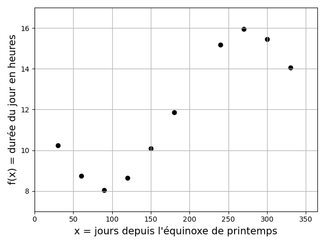
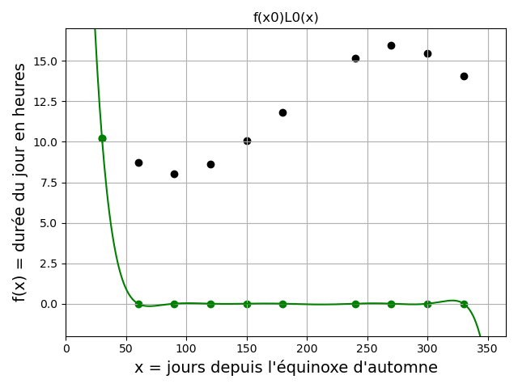

# Chapitre III : Interpolation polynomiale

Ce chapitre porte sur les méthodes numériques pour l'approximation de valeures inconnues d'une fonction à partir des valeurs connues, par interpolation avec un polynôme.

---

## Position du problème

### Motivation

Soit une fonction $f(x)$ connue en seulement $n+1$ points, appelés **points** ou **noeuds d'interpolation** $(x_i,f(x_i))$ avec $i=0,1,2,...,n$ de l'intervalle $[a,b]$.
Peut-on approcher $f(x)$ pour tout $x$ de $[a,b]$ par une fonction ?

Il existe une infinité de fonctions d'interpolation, mais le plus simple est d'approcher la fonction par un **polynôme de degré suffisamment élevé** pour que sa courbe passe par les point d'interpolation.

Un polynôme $p$ de degré inférieur ou égal à $n$ s'exprime dans la **base canonique** ${1,x,x^2,...,x^n}$ de la manière suivante :

$p(x) = \displaystyle\sum_{k=0}^{n} a_k x^k$ où les $a_k$ sont les coefficients du polynôme.

**L'interpolation polynomiale consiste donc à déterminer les coefficients $a_k$ tels que $p(x_i) = f(x_i)$ pour $i=0,1,2,...,n$.**

**NB :** L'interpolation polynomiale pourra sont utiles pour les méthodes numériques de calcul d'intégrales et de dérivées.

**Attention !** L'interpolation polynomiale et l'approximation polynomiales sont des approches différentes.
L'approximation polynomiale de données bruitées cherche un polynôme de degré inférieur au nombre de données qui ne passe pas nécessairement par tous les points connus.

### Existence et unicité d'un polynôme d'interpolation

|Théorème d'Evariste Galois|
|:-|
|Un polynôme de degré $n$ a **au plus** $n$ racines qui peuvent être réelles ou complexes conjuguées.|

D'où le corollaire :

|Corollaire|
|:-|
|On ne peut faire passer par $n+1$ points distincts **qu'un seul** polynôme de degré n.|

**Toutes les méthodes présentées dans la suite de ce chapitre doivent donc aboutir au même polynôme**.

### Exemple de problème

Au cours de ce chapitre, nous appliquerons les différentes méthodes numériques d'interpolation polynomiale à un même exemple : **l'estimation de la durée du jour à l'UFR des sciences de l'UVSQ**.

La durée du jour (temps entre le lever et le coucher du soleil) en heures peut être approximée par la fonction $f$ suivante :

$f(x) = \frac{48}{2 \pi} \arccos(\tan(\lambda) \tan(\arcsin(\sin(\frac{2 \pi x}{365}) \sin(\delta))))$

avec $x$ le jour depuis l'équinoxe de printemps, $\lambda$ la latitude du lieu, et $\delta$ la latitude des tropiques.

On sait que $\delta \approx 23.438403°$.
On prendra ici l'exemple de l'UFR des sciences de l'UVSQ, dont la latitude est $\lambda \approx 48.81094°$.

On peut voir que cette formule implique 6 appels à des fonctions trigonométriques, ce qui peut rendre non négligeable le temps nécessaire pour évaluer $f$ en un grand nombre de points.
D'où l'intérêt de n'évaluer la fonction qu'en un nombre limité de points, et d'utiliser l'interpolation polynomiale pour déterminer d'autres valeurs de $f(x)$.

Nous choisirons ici d'évaluer la fonction pour les 10 valeurs de $x$ suivantes :

|x = jours depuis l'équinoxe de printemps|30   |60  |90  |120 |150  |180  |240  |270  |300  |330  |
|:---------------------------------------|:---:|:--:|:--:|:--:|:---:|:---:|:---:|:---:|:---:|:---:|
|f(x) = durée du jour en heures          |10.24|8.73|8.04|8.63|10.09|11.84|15.16|15.95|15.47|14.06|

Et nous essayerons d'estimer la valeur de $f$ pour $x = 210$ (i.e. la durée du jour en heures pour le 210ème jour depuis l'équinoxe de printemps) par interpolation polynomiale.

Sous Python on utilisera la bibliothèque Numpy :

~~~
import numpy as np
~~~

Puis, on définira les variables globales suivantes :

~~~
l = 48.81094*np.pi/180 #Latitude de l'UFR des sciences
a = 23.438403*np.pi/180 #Latitude des tropiques
~~~

La fonction $f$ sera définie comme :

~~~
def f(d):
    
    return 48/(2*np.pi)*np.arccos(np.tan(l)*np.tan(np.arcsin(np.sin(a)*np.sin(d*2*np.pi/365.25))))
~~~

On calculera alors les 10 valeurs "connues" de la fonction de la manière suivante :

~~~
x = np.array([30,60,90,120,150,180,240,270,300,330],dtype='float')
y = f(x)
~~~

(On a ici définit avec Numpy un vecteur de 10 valeurs $x$, auquel on a appliqué $f$. Le vecteur résultant est stocké dans $y$).

## Matrices de Vandermonde

Une 1ère approche pour obtenir un polynôme d'interpolation est la suivante : déterminer les coefficients $a_i$ du polynôme en résolvant les $(n+1)$ équations de collocation $p(x_i) = f(x_i)$ pour $i=0,1,2,...,n$.

Ceci revient à résoudre le système linéaire de $(n+1)$ équations à $(n+1)$ inconnues :

$\begin{cases}
a_0 + a_1 x_0 + a_2 x_0^2 + ... + a_n x_0^n = f(x_0)\\
a_0 + a_1 x_1 + a_2 x_1^2 + ... + a_n x_1^n = f(x_1)\\
...\\
a_0 + a_1 x_n + a_2 x_n^2 + ... + a_n x_n^n = f(x_n)
\end{cases}$

Ce système admet une unique solution si les $x_i$ sont distincts 2 à 2.

Il peut s'écrire sous la forme matricielle suivante :

$\begin{pmatrix}
  1 & x_0 & x_0^2 & \cdots & x_0^n \\
  1 & x_1 & x_1^2 & \cdots & x_1^n \\
  \vdots  & \vdots  & \ddots & \vdots  \\
  1 & x_n & x_n^2 &\cdots & x_n^n 
 \end{pmatrix}
 \begin{pmatrix}
  a_0\\
  a_1\\
  \vdots\\
  a_n 
 \end{pmatrix}
 =
 \begin{pmatrix}
  f(x_0)\\
  f(x_1)\\
  \vdots\\
  f(x_n) 
 \end{pmatrix}$
 
On reconnait ici une **matrice de Vandermonde**.

La matrice de Vandermonde est inversible si et seulement si les $x_i$ sont distincts 2 à 2.

Dans la pratique, l'inversion de la matrice de Vandermonde **ne conduit pas à une solution satisfaisante** :

- Le nombre d'équations / d'inconnues croit avec le nombre de points d'interpolations, augmentant le nombre d'opérations de l'ordre de $2 n^3 / 3$.

- Ce type de système est souvent mal conditionné, ce qui rend la solution numérique très sensible aux erreurs d'arrondi.

C'est pourquoi dans la suite, on va préférer des techniques exprimant le polynôme dans **une autre base que la base canonique**.

## Polynômes de Lagrange

### L'algorithme

|Base de Lagrange|
|:-|
|Soient des $x_i$ (avec $i=0,1,2,...,n$) 2 à 2 distincts.|
|On appelle base de Lagrange relative aux points x_i les polynômes :|
|$L_i(x) = \displaystyle\prod_{j=0 , j \neq i}^{n} \frac{(x-x_j)}{x_i-x_j}$|
|soit $L_i(x) = \frac{(x-x_0)(x-x_1)...(x-x_n)}{(x_i-x_0)(x_i-x_1)...(x_i-x_n)}$|
|$L_i$ vérifie $L_i(x_i)=1$ et $L_i(x_j)=0$ si $j \neq i$.|

La famille des $(L_i(x))$ forme une base de l'ensemble des polynômes, et le polynôme qui interpoles les valeurs de $f(x_i)$ aux points $x_i$ s'écrit :

$p(x) = \displaystyle\sum_{i=0}^{n} f(x_i) L_i(x) = f(x_0) L_0(x) + f(x_1) L_1(x) + ... + f(x_n) L_n(x)$

$p$ vérifie bien que $\forall i = 0,1,2,...,n$, $p(x_i) = f(x_i)$ et est unique si les points $x_i$ sont distincts.

Les coefficients du polynôme sont directements les valeurs $f(x_i)$, qui sont connues.

Voici l'algorithme sous la forme d'une fonction Python.

Elle prend en entrée :

* `x` le vecteur des abscisses des point connus.

* `y` le vecteur des ordonnées des points connus.

* `xp` l'abscisse du point que l'on veut interpoler.

~~~
def lagrange(x,y,xp):
    
    #Récupération du nombre de points connus :
    n = len(x)
    
    #Initialisation de l'ordonnée du point interpolé yp :
    yp = 0
    
    #1ère boucle sur les points connus (x[i],y[i]) :
    for i in range(n):
        
        #Initialisation du polynôme de la base de Lagrange associé au i-ème 
        #point connu Li :
        Li = 1

        #2ème boucle sur les abscisses connues x[j]:
        for j in range(n):
            
            #Dans le cas où les 2 abscisses connues x[i] et x[j] sont distinctes,
            #multiplication de Li par un coefficient obtenu avec xp, x[i] et 
            #x[j], de telle façon que Li = 1 si xp = x[i] et Li = 0 si xp = x[j] 
            #(voir formule du cours) :
            if j!=i:
                Li = Li*(xp-x[j])/(x[i]-x[j])
           
        #Addition à yp de la valeur du polynôme y[i] Li, qui est égal à y[i] en 
        #x[i] et nul pour tout les x[j] (voir formule du cours):
        yp = yp + y[i]*Li
        
    #Renvoyer l'ordonnée du point interpolé :    
    return yp
~~~

La base des polynômes de Lagrange permet de ne pas avoir à résoudre un système linéaire de $n+1$ équations à $n+1$ inconnues.
Lorsque $n$ est petit, il reste cependant plus simple de résoudre le système d'équations.

Un désaventage pratique de l'interpolation de Lagrange est le fait qu'il soit nécessaire tout recalculer si on ajoute un point d'interpolation.
L'interpolation de Newton, présentée dans la suite, n'a pas ce désaventage.

### Exemple

Voici la construction du polynôme de Lagrange pour notre problème exemple :

On observe bien que pour $i=0,1,...,9$, chaque $f(x_i)L_i(x)$ passe par $f(x_i)$ en $x = x_i$ et par 0 en $x = x_j$ pour $j \neq i$.
Le polynôme construit passe bien par $f(x_i)$ pour tous les $x_i$.

On trouve une valeur interpolée en $x = 210$ d'environ 13.61.

**Exercice :**

En modifiant la fonction Python donnée précédemment pour l'interpolation de Lagrange, ainsi que la fonction $f$, déterminez l'erreur d'interpolation en $x = 210$ avec 4 chiffres significatifs.

## Polynômes de Newton

### L'algorithme

|Base de Newton|
|:-|
|Soient des $x_i$ (avec $i=0,1,2,...,n$) 2 à 2 distincts.|
|On appelle base de Newton relative aux points $x_i$ les polynômes :|
|$v_0(x) = 1$|
|$v_i(x) = \displaystyle\prod_{j=0}^{i-1} (x-x_j) = (x-x_0)(x-x_1)...(x-x_{i-1})$|
|$v_i$ vérifie $v_i(x_j) = 0$ pour $j<i$.|

La famille $(v_i(x))$ forme une base de l'ensemble des polynômes, et le polynôme qui interpole les valeurs $f(x_i)$ aux points $x_i$ s'écrit :

$p(x) = \displaystyle\sum_{i=0}^{n} c_i v_i(x) = c_0 v_0(x) + c_1 v_1(x) + ... + c_n v_n(x)$

avec des coefficients c_i à déterminer, tels que $p(x_i) = f(x_i) \forall i = 0,1,2,...,n$.

$p$ est unique si les $x_i$ sont 2 à 2 distincts.

L'un des intérêts de la base de Newton est que si l'on ajoute un nouveau point d'interpolation $(x_{n+1},f(x_{n+1}))$, les coefficients $c_0,c_1,c_2,...,c_n$ restent inchangés et **il suffit de calculer $c_{n+1}$ et d'ajouter un terme $c_{n+1} v_{n+1}$ à l'expression de $p$**.

Les $c_i$ sont les solutions du système linéaire (triangulaire inférieur) suivant :

$\begin{cases}
f(x_0) = c_0 v_0(x_0) = c_0\\
f(x_1) = c_0 + c_1 v_1(x_1) = f(x_0) + c_1 (x_1-x_0)\\
f(x_2) = c_0 + c_1 v_1(x_2) + c_2 v_2(x_2) = f(x_0) + c_1 (x_2-x_0) + c_2 (x_2-x_0)(x_2-x_1)\\
...\\
f(x_n) = c_0 + \displaystyle\sum_{i=1}^{n} c_i v_i(x_n)
\end{cases}$

Ce système est en apparence simple, et peut être résolu de proche en proche.
Mais dans la pratique, les expressions des $c_i$ deviennent de plus en plus complexes.

C'est pourquoi on fait appel aux **différences divisées** pour exprimer les coefficients de façon compacte.

|Les différences divisées|
|:-|
|Soit $f$ une fonction définie aux points $x_i$, 2 à 2 distincts.|
|On définit les différences divisées par récurrence comme suit :|
|$\begin{cases}
f[x_i] = f(x_i) (ordre 0) pour i=0,...,n\\
f[x_i...x_{i+k}] = \frac{f[x_i...x_{i+k-1}]-f[x_{i+1}...x_{i+k}]}{x_i-x_{i+k}} (ordre k>0) pour i=0,...,n
\end{cases}$|

Les coefficients $c_i$ peuvent être calculés par récurrence à partir des différences divisées de la manière suivante :

$c_i = f[x_0 x_1 x_i] = \frac{f[x_0 x_1 ... x_{i-1}]-f[x_1 x_2 ... x_i]}{x_0-x_i}$

C'est ce que l'on appelle la **différence divisée d'ordre i**.

Le polynôme d'interpolation de Newton de degré $n$ qui interpole les valeurs $f(x_i)$ aux points $x_i$ $(i=0,1,2,...,n)$, distincts 2 à 2, s'écrit donc :

$p(x) = \displaystyle\sum_{i=0}^{n} f[x_0 x_1 ... x_i] v_i(x)$

Soit $p(x) = f[x_0] + f[x_0 x_1] (x-x_0) + f[x_0 x_1 x_2] (x-x_0)(x-x_1) + ... + f[x_0 x_1 ... x_n] \displaystyle\prod_{j=0}^{n-1} (x-x_j)$

Le calcul **effectif** du polynôme d'interpolation se fait donc de la manière suivante :

### Exemple

## Erreur d'interpolation

## Interpolation aux noeuds de Chebychev

## Interpolation par morceaux

### Interpolation affine

### Interpolation par fonctions splines
