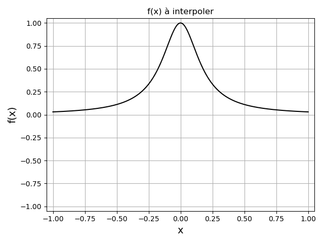
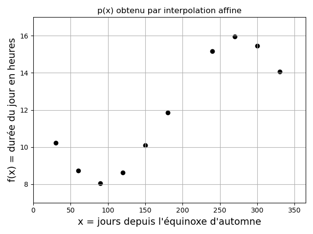

# Chapitre III : Interpolation polynomiale

Ce chapitre porte sur les méthodes numériques pour l'approximation de valeurs inconnues d'une fonction à partir des valeurs connues, par interpolation avec un polynôme.

---

## Position du problème

### Motivation

Soit une fonction $f(x)$ connue en seulement $n+1$ points, appelés **points** ou **noeuds d'interpolation** $(x_i,f(x_i))$ avec $i=0,1,2,...,n$ de l'intervalle $[a,b]$.
Peut-on approcher $f(x)$ pour tout $x$ de $[a,b]$ par une fonction ?

Il existe une infinité de fonctions d'interpolation, mais le plus simple est d'approcher la fonction par un **polynôme de degré suffisamment élevé** pour que sa courbe passe par les point d'interpolation.

Un polynôme $p$ de degré inférieur ou égal à $n$ s'exprime dans la **base canonique** ${1,x,x^2,...,x^n}$ de la manière suivante :

$p(x) = \displaystyle\sum_{k=0}^{n} a_k x^k$ où les $a_k$ sont les coefficients du polynôme.

**L'interpolation polynomiale consiste donc à déterminer les coefficients $a_k$ tels que $p(x_i) = f(x_i)$ pour $i=0,1,2,...,n$.**

**NB :** L'interpolation polynomiale pourra sont utiles pour les méthodes numériques de calcul d'intégrales et de dérivées.

**Attention !** L'interpolation polynomiale et l'approximation polynomiales sont des approches différentes.
L'approximation polynomiale de données bruitées cherche un polynôme de degré inférieur au nombre de données qui ne passe pas nécessairement par tous les points connus.

### Existence et unicité d'un polynôme d'interpolation

|Théorème d'Evariste Galois|
|:-|
|Un polynôme de degré $n$ a **au plus** $n$ racines qui peuvent être réelles ou complexes conjuguées.|

D'où le corollaire :

|Corollaire|
|:-|
|On ne peut faire passer par $n+1$ points distincts **qu'un seul** polynôme de degré n.|

**Toutes les méthodes présentées dans la suite de ce chapitre doivent donc aboutir au même polynôme**.

### Exemple de problème

Au cours de ce chapitre, nous appliquerons les différentes méthodes numériques d'interpolation polynomiale à un même exemple : **l'estimation de la durée du jour à l'UFR des sciences de l'UVSQ**.

La durée du jour (temps entre le lever et le coucher du soleil) en heures peut être approximée par la fonction $f$ suivante :

$f(x) = \frac{48}{2 \pi} \arccos(\tan(\lambda) \tan(\arcsin(\sin(\frac{2 \pi x}{365}) \sin(\delta))))$

avec $x$ le jour depuis l'équinoxe d'automne, $\lambda$ la latitude du lieu, et $\delta$ la latitude des tropiques.

On sait que $\delta \approx 23.438403°$.
On prendra ici l'exemple de l'UFR des sciences de l'UVSQ, dont la latitude est $\lambda \approx 48.81094°$.

On peut voir que cette formule implique 6 appels à des fonctions trigonométriques, ce qui peut rendre non négligeable le temps nécessaire pour évaluer $f$ en un grand nombre de points.
D'où l'intérêt de n'évaluer la fonction qu'en un nombre limité de points, et d'utiliser l'interpolation polynomiale pour déterminer d'autres valeurs de $f(x)$.

Nous choisirons ici d'évaluer la fonction pour les 10 valeurs de $x$ suivantes :

|x = jours depuis l'équinoxe d'automne|30   |60  |90  |120 |150  |180  |240  |270  |300  |330  |
|:---------------------------------------|:---:|:--:|:--:|:--:|:---:|:---:|:---:|:---:|:---:|:---:|
|f(x) = durée du jour en heures          |10.24|8.73|8.04|8.63|10.09|11.84|15.16|15.95|15.47|14.06|

Et nous essayerons d'estimer la valeur de $f$ pour $x = 210$ (i.e. la durée du jour en heures pour le 210ème jour depuis l'équinoxe d'automne) par interpolation polynomiale.

Sous Python on utilisera la bibliothèque Numpy :

~~~
import numpy as np
~~~

Puis, on définira les variables globales suivantes :

~~~
l = 48.81094*np.pi/180 #Latitude de l'UFR des sciences
a = 23.438403*np.pi/180 #Latitude des tropiques
~~~

La fonction $f$ sera définie comme :

~~~
def f(d):
    
    return 48/(2*np.pi)*np.arccos(np.tan(l)*np.tan(np.arcsin(np.sin(a)*np.sin(d*2*np.pi/365.25))))
~~~

On calculera alors les 10 valeurs "connues" de la fonction de la manière suivante :

~~~
x = np.array([30,60,90,120,150,180,240,270,300,330],dtype='float')
y = f(x)
~~~

(On a ici définit avec Numpy un vecteur de 10 valeurs $x$, auquel on a appliqué $f$. Le vecteur résultant est stocké dans $y$).

## Matrices de Vandermonde

Une 1ère approche pour obtenir un polynôme d'interpolation est la suivante : déterminer les coefficients $a_i$ du polynôme en résolvant les $(n+1)$ équations de collocation $p(x_i) = f(x_i)$ pour $i=0,1,2,...,n$.

Ceci revient à résoudre le système linéaire de $(n+1)$ équations à $(n+1)$ inconnues :

$\begin{cases}
a_0 + a_1 x_0 + a_2 x_0^2 + ... + a_n x_0^n = f(x_0)\\
a_0 + a_1 x_1 + a_2 x_1^2 + ... + a_n x_1^n = f(x_1)\\
...\\
a_0 + a_1 x_n + a_2 x_n^2 + ... + a_n x_n^n = f(x_n)
\end{cases}$

Ce système admet une unique solution si les $x_i$ sont distincts 2 à 2.

Il peut s'écrire sous la forme matricielle suivante :

$\begin{pmatrix}
  1 & x_0 & x_0^2 & \cdots & x_0^n \\
  1 & x_1 & x_1^2 & \cdots & x_1^n \\
  \vdots  & \vdots  & \vdots & \vdots & \vdots \\
  1 & x_n & x_n^2 &\cdots & x_n^n 
 \end{pmatrix}
 \begin{pmatrix}
  a_0\\
  a_1\\
  \vdots\\
  a_n 
 \end{pmatrix}
 =
 \begin{pmatrix}
  f(x_0)\\
  f(x_1)\\
  \vdots\\
  f(x_n) 
 \end{pmatrix}$
 
On reconnait ici une **matrice de Vandermonde**.

La matrice de Vandermonde est inversible si et seulement si les $x_i$ sont distincts 2 à 2.

Dans la pratique, l'inversion de la matrice de Vandermonde **ne conduit pas à une solution satisfaisante** :

- Le nombre d'équations / d'inconnues croit avec le nombre de points d'interpolations, augmentant le nombre d'opérations de l'ordre de $2 n^3 / 3$.

- Ce type de système est souvent mal conditionné, ce qui rend la solution numérique très sensible aux erreurs d'arrondi.

C'est pourquoi dans la suite, on va préférer des techniques exprimant le polynôme dans **une autre base que la base canonique**.

## Polynômes de Lagrange

### L'algorithme

|Base de Lagrange|
|:-|
|Soient des $x_i$ (avec $i=0,1,2,...,n$) 2 à 2 distincts.|
|On appelle base de Lagrange relative aux points x_i les polynômes :|
|$L_i(x) = \displaystyle\prod_{j=0 , j \neq i}^{n} \frac{(x-x_j)}{x_i-x_j}$|
|soit $L_i(x) = \frac{(x-x_0)(x-x_1)...(x-x_n)}{(x_i-x_0)(x_i-x_1)...(x_i-x_n)}$|
|$L_i$ vérifie $L_i(x_i)=1$ et $L_i(x_j)=0$ si $j \neq i$.|

La famille des $(L_i(x))$ forme une base de l'ensemble des polynômes, et le polynôme qui interpoles les valeurs de $f(x_i)$ aux points $x_i$ s'écrit :

$p(x) = \displaystyle\sum_{i=0}^{n} f(x_i) L_i(x) = f(x_0) L_0(x) + f(x_1) L_1(x) + ... + f(x_n) L_n(x)$

$p$ vérifie bien que $\forall i = 0,1,2,...,n$, $p(x_i) = f(x_i)$ et est unique si les points $x_i$ sont distincts.

Les coefficients du polynôme sont directements les valeurs $f(x_i)$, qui sont connues.

Voici l'algorithme sous la forme d'une fonction Python.

Elle prend en entrée :

* `x` le vecteur des abscisses des point connus.

* `y` le vecteur des ordonnées des points connus.

* `xp` l'abscisse du point que l'on veut interpoler.

On notera les variables suivantes :

* `Li` le polynôme de la base de Lagrange associé au point $x_i$.

* `yp` l'ordonnée du point que l'on veut interpoler.

~~~
def lagrange(x,y,xp):
    
    #Récupération du nombre de points connus :
    n = len(x)
    
    #Initialisation de l'ordonnée du point interpolé yp :
    yp = 0
    
    #1ère boucle sur les points connus (x[i],y[i]) :
    for i in range(n):
        
        #Initialisation du polynôme de la base de Lagrange associé au i-ème 
        #point connu Li :
        Li = 1

        #2ème boucle sur les abscisses connues x[j]:
        for j in range(n):
            
            #Dans le cas où les 2 abscisses connues x[i] et x[j] sont distinctes,
            #multiplication de Li par un coefficient obtenu avec xp, x[i] et 
            #x[j], de telle façon que Li = 1 si xp = x[i] et Li = 0 si xp = x[j] 
            #(voir formule du cours) :
            if j!=i:
                Li = Li*(xp-x[j])/(x[i]-x[j])
           
        #Addition à yp de la valeur du polynôme y[i] Li, qui est égal à y[i] en 
        #x[i] et nul pour tout les x[j] (voir formule du cours):
        yp = yp + y[i]*Li
        
    #Renvoyer l'ordonnée du point interpolé :    
    return yp
~~~

La base des polynômes de Lagrange permet de ne pas avoir à résoudre un système linéaire de $n+1$ équations à $n+1$ inconnues.
Lorsque $n$ est petit, il reste cependant plus simple de résoudre le système d'équations.

Un désaventage pratique de l'interpolation de Lagrange est le fait qu'il soit nécessaire tout recalculer si on ajoute un point d'interpolation.
L'interpolation de Newton, présentée dans la suite, n'a pas ce désaventage.

### Exemple

Voici la construction du polynôme de Lagrange pour notre problème exemple :

On observe bien que pour $i=0,1,...,9$, chaque $f(x_i)L_i(x)$ passe par $f(x_i)$ en $x = x_i$ et par 0 en $x = x_j$ pour $j \neq i$.
Le polynôme construit passe bien par $f(x_i)$ pour tous les $x_i$.

On trouve une valeur interpolée en $x = 210$ d'environ 13.61.

**Exercice :**

En modifiant la fonction Python donnée précédemment pour l'interpolation de Lagrange, ainsi que la fonction $f$, déterminez l'erreur d'interpolation en $x = 210$ avec 4 chiffres significatifs.

## Polynômes de Newton

### L'algorithme

|Base de Newton|
|:-|
|Soient des $x_i$ (avec $i=0,1,2,...,n$) 2 à 2 distincts.|
|On appelle base de Newton relative aux points $x_i$ les polynômes :|
|$v_0(x) = 1$|
|$v_i(x) = \displaystyle\prod_{j=0}^{i-1} (x-x_j) = (x-x_0)(x-x_1)...(x-x_{i-1})$|
|$v_i$ vérifie $v_i(x_j) = 0$ pour $j<i$.|

La famille $(v_i(x))$ forme une base de l'ensemble des polynômes, et le polynôme qui interpole les valeurs $f(x_i)$ aux points $x_i$ s'écrit :

$p(x) = \displaystyle\sum_{i=0}^{n} c_i v_i(x) = c_0 v_0(x) + c_1 v_1(x) + ... + c_n v_n(x)$

avec des coefficients c_i à déterminer, tels que $p(x_i) = f(x_i) \forall i = 0,1,2,...,n$.

$p$ est unique si les $x_i$ sont 2 à 2 distincts.

L'un des intérêts de la base de Newton est que si l'on ajoute un nouveau point d'interpolation $(x_{n+1},f(x_{n+1}))$, les coefficients $c_0,c_1,c_2,...,c_n$ restent inchangés et **il suffit de calculer $c_{n+1}$ et d'ajouter un terme $c_{n+1} v_{n+1}$ à l'expression de $p$**.

Les $c_i$ sont les solutions du système linéaire (triangulaire inférieur) suivant :

$\begin{cases}
f(x_0) = c_0 v_0(x_0) = c_0\\
f(x_1) = c_0 + c_1 v_1(x_1) = c_0 + c_1 (x_1-x_0)\\
f(x_2) = c_0 + c_1 v_1(x_2) + c_2 v_2(x_2) = c_0 + c_1 (x_2-x_0) + c_2 (x_2-x_0)(x_2-x_1)\\
...\\
f(x_n) = c_0 + \displaystyle\sum_{i=1}^{n} c_i v_i(x_n)
\end{cases}$

Ce système est en apparence simple, et peut être résolu de proche en proche.
Mais dans la pratique, les expressions des $c_i$ deviennent de plus en plus complexes.

C'est pourquoi on fait appel aux **différences divisées** pour exprimer les coefficients de façon compacte.

|Les différences divisées|
|:-|
|Soit $f$ une fonction définie aux points $x_i$, 2 à 2 distincts.|
|On définit les différences divisées par récurrence comme suit :|
|$\begin{cases} f[x_i] = f(x_i), i=0,...,n\\ f[x_i...x_{i+k}] = \frac{f[x_i...x_{i+k-1}]-f[x_{i+1}...x_{i+k}]}{x_i-x_{i+k}}, i=0,...,n \end{cases}$|
|avec $k$ l'ordre de la récurrence.|

Les coefficients $c_i$ peuvent être calculés par récurrence à partir des différences divisées de la manière suivante :

$c_i = f[x_0 x_1 ... x_i] = \frac{f[x_0 x_1 ... x_{i-1}]-f[x_1 x_2 ... x_i]}{x_0-x_i}$

C'est ce que l'on appelle la **différence divisée d'ordre i**.

Le polynôme d'interpolation de Newton de degré $n$ qui interpole les valeurs $f(x_i)$ aux points $x_i$ $(i=0,1,2,...,n)$, distincts 2 à 2, s'écrit donc :

$p(x) = \displaystyle\sum_{i=0}^{n} f[x_0 x_1 ... x_i] v_i(x)$

Soit $p(x) = f[x_0] + f[x_0 x_1] (x-x_0) + f[x_0 x_1 x_2] (x-x_0)(x-x_1) + ... + f[x_0 x_1 ... x_n] \displaystyle\prod_{j=0}^{n-1} (x-x_j)$

Le calcul **effectif** du polynôme d'interpolation se fait donc de la manière suivante :

|     |$i=0$         |$i=1$             |$i=2$                   | ... |$i=n$                     |
|:---:|:------------:|:----------------:|:----------------------:|:---:|:------------------------:|
|$x_0$|$f[x_0] = c_0$|                  |                        | ... |                          |
|$x_1$|$f[x_1]$      |$f[x_0 x_1] = c_1$|                        | ... |                          |
|$x_2$|$f[x_2]$      |$f[x_1 x_2]$      |$f[x_0 x_1 x_2] = c_2$  | ... |                          |
| ... |...           |...               |...                     | ... |                          |
|$x_n$|$f[x_n]$      |$f[x_{n-1} x_n]$  |$f[x_{n-2} x_{n-1} x_n]$| ... |$f[x_0 x_1 ... x_n] = c_n$|

Seules les valeurs sur la diagonale interviennent dans l'expression du polynôme d'interpolation de Newton.

Si on ajoute un nouveau point d'interpolation $(x_{n+1})$, il suffit d'ajouter une ligne au tableau.

Pour déterminer les valeurs de ce tableau, on applique la méthode ici illustrée pour 3 points d'interpolation, en enregistrant les coefficients dans un vecteur $C$ :

Une fois les coefficients calculés, on utilise la stratégie de l'**algorithme de Horner** pour le calcul effectif du polynôme interpolateur de Newton.
Cette stratégie se base sur le schéma suivant, ici illustré pour 4 points :

$p(x) = c_0 + c_1 (x-x_0) + c_2 (x-x_0) (x-x_1) + c_3 (x-x_0) (x-x_1) (x-x_2)$
$= c_0 + (x-x_0) (c_1 + (c_2 (x-x_1) + c_3 (x-x_1) (x-x_2)))$
$= c_0 + (x-x_0) (c_1 + (x-x_1)(c_2 + c_3 (x-x_2)))$

Cette méthode permet de réduire considérablement le nombre d'opérations nécessaires au calcul du polynôme.

Voici l'algorithme sous la forme d'une fonction Python.

Elle prend en entrée :

* `x` le vecteur des abscisses des point connus.

* `y` le vecteur des ordonnées des points connus.

* `xp` l'abscisse du point que l'on veut interpoler.

On notera les variables suivantes :

* `c` le vecteur des coefficients du polynôme de Newton.

* `yp` l'ordonnée du point que l'on veut interpoler.

~~~
def newton(x,y,xp):
    
    #Récupération du nombre de points connus :
    n = len(x)
    
    #Initialisation d'un vecteur nul qui contiendra les coefficients du 
    #polynôme de Newton :
    c = np.zeros(n)
    
    #Boucle sur les ordonnées connues pour déterminer la 1ère colonne du 
    #tableau des différences divisées (ordre 0) :
    for i in range(n):
        
        c[i] = y[i]
    
    #Boucle pour calculer les colonnes du tableau des différences divisées 
    #(de gauche à droite):
    for i in range(1,n):
        
        #Boucle pour calculer les lignes du tableau des différences divisées 
        #(du bas jusqu'à la diagonale de chaque colonnes):
        for k in range(n-1,i-1,-1):
            
            c[k] = (c[k]-c[k-1])/(x[k]-x[k-i])
            #(Avec cette formule récursive sur les éléments du vecteur des 
            #coefficients, on ne gardera en mémoire que les éléments de la 
            #diagonale du tableau des différences divisées).
          
    
    #Calcul de l'ordonnée du point interpolé avec l'algorithme de Horner :
    yp = c[n-1]
    
    for i in range(n-2,-1,-1):
        
        yp = c[i] + (xp-x[i])*yp
        
    #Renvoyer l'ordonnée du point interpolé :    
    return yp
~~~

### Exemple

Voici la construction du polynôme de Newton pour notre problème exemple :

On observe bien qu'au fur et à mesure que pour $i=0,1,...,9$, on ajoute les $c_i v_i(x)$ au polynôme, il passe par un point d'interpolation $x_i$ de plus.
Le polynôme construit passe bien par $f(x_i)$ pour tous les $x_i$.

On trouve encore une fois une valeur interpolée en $x = 210$ d'environ 13.61 (résultat attendu puisqu'il s'agit en théorie du même polynôme d'interpolation que celui obtenu avec la méthode de Lagrange).

**Exercice :**

En modifiant la fonction Python donnée précédemment pour l'interpolation de Newton, ainsi que la fonction $f$, déterminez l'erreur d'interpolation en $x = 210$ avec 4 chiffres significatifs.
Comparez cette valeur à l'erreur obtenue pour l'interpolation de Lagrange. Interprétez ce résultat.

## Erreur d'interpolation

### Formule de Taylor-Young

|Théorème de Taylor-Young|
|:-|
|Soit $f$ une fonction continument dérivable jusqu'à l'ordre $n+1$ sur un intervalle $I=[a,b]$|
|contenant $n+1$ points d'interpolation $x_i$ ($i=0,1,2,...,n$).|
|Alors $\forall x \in I$, $\exists c \in I$ tel que :|
|$e(x) = f(x) - p(x) = \frac{f^{(n+1)}(c)}{(n+1)!} \displaystyle\prod_{i=0}^{n} (x-x_i)$|

Aux points d'interpolation, on a bien entendu $e(x_i) = 0$ ($i=0,1,2,...,n$).

La formule de **Taylor-Young** permet de borner l'erreur, et si possible de guider le choix des points d'interpolation.

Dans le cas d'une distribution uniforme de points d'interpolation, on note :
$x_i = x_{i-1} + h = x_0 + i h$ avec $i=1,2,...,n$ et $h>0$ et $x_0$ donnés.
Par exemple, $x_0=a$ et $h = \frac{b-a}{n}$ sur $[a,b]$.

On montre alors que l'erreur d'interpolation est de l'ordre de $O(h^n)$.
Plus exactement :

$max_{x \in [a,b]} e(x) \leq \frac{max_{x \in [a,b]} f^{(n+1)}(x)}{4(n+1)} h^{n+1}$

### Phénomène de Runge

Cependant, même dans le cas d'une distribution uniforme des points d'interpolation, l'erreur ne tend pas nécessairement vers 0 quand $n$ tend vers l'infini.

Quand l'erreur tend vers l'infini quand $n$ tend vers l'infini, on parle de **phénomène de Runge**.

Voici par exemple une fonction connue pour être sensible au phénomène de Runge :

$f(x) = \frac{1}{1+32x^2}$

Voici le polynôme de Lagrange obtenu pour différents nombres de points d'interpolation équidistants :

On voit des oscillations apparaitre, particulièrement au voisinage des extrémités de l'intervalle, lorsque le nombre de points d'interpolation augmente.

On peut éviter le phénomène de Runge en choisissant correctement la distribution des points d'interpolation.
En particulier, ce phénomène ne survient pas lorsque les points d'interpolation sont **les racines du polynôme de Chebychev**.

## Interpolation aux noeuds de Chebychev

|Définition|
|:-|
|On définit le **polynôme de Chebychev** de degré $n$ par :|
|$T_n(x) = cos(n cos(x)) \in [-1,1]$|
|$T_n$ possède $n$ racines dans $[-1,1]$.|
|Les racines de ce polynôme sont :|
|$x_i = cos(\frac{(2i+1) \pi}{2n})$ avec $i=0,1,2,...,n-1$|
|Plus généralement, sur un intervalle $[a,b]$ :|
|$x_i = \frac{a+b}{2} + \frac{b-a}{2} cos(\frac{(2i+1) \pi}{2n})$|

On peut montrer que l'erreur $e(x) = f(x)-p(x)$ est minimale lorsque les points d'interpolation correspondent aux racines du polynôme de Chebychev.

Toutes les fonctions continuement dérivables voient leur polynôme d'interpolation **converger** pour ce choix de points d'interpolation.

Voici à nouveau le polynôme de Lagrange obtenu avec $f(x) = \frac{1}{1+32x^2}$ pour différents nombres de points d'interpolation, mais cette fois-ci en utilisant le polynôme de Chebychev :

Comme prévu, le polynôme d'interpolation converge avec la fonction quand le nombre de points augmente.
On a bien évité le phénomène de Runge.

## Interpolation par morceaux

L'interpolation polynomiale ne permet pas de correctement interpoler des fonctions qui varient rapidement.
Il faudrait des polynômes de degré élevé, ce qui entrainerait des oscillations.

|Idée|
|:-|
|Pour éviter les oscillations, on peut utiliser **l'interpolation par morceaux avec des polynômes de degré faible** :|
|- Des fonctions affines : **interpolation affine** ou **linéaire composite**.|
|- Des fonctions splines cubiques : **interpolation par splines cubiques**.|

|Principe|
|:-|
|Etant donnée une distribution de points $a=x_0<x_1<...<x_n=b$,|
|on construit une approximation polynomiale de la fonction $f$ sur chaque sous-intervalle $[x_i,x_{i+1}]$ $(i=0,1,...,n-1)$.|
|On obtient ainsi une fonction $g$ telle que $g(x_i) = f(x_i)$ pour $i=0,1,2,...,n$ :|
|- Si $g$ est de degré 0 ou 1 : ligne brisée (interpolation affine).|
|- Si $g$ est de degré >1 : le choix n'est plus unique, et on ajoute des conditions de régularité aux noeuds pour que $g$ soit continument dérivable en ces points.|

### Interpolation affine

Sur chaque sous-intervalle $[x_i,x_{i+1}]$ avec $i=0,1,...,n-1$, on interpole $f$ par un polynôme de degré inférieur ou égal à 1 :

$g(x) = f(x_i) + \frac{f(x_{i+1})-f(x_i)}{x_{i+1}-x_i} (x-x_i)$

ou $g(x) = f(x_i) + f[x_{i+1} x_i] (x-x_i)$

Si $f$ est 2 fois dérivables sur $[a,b] = [x_0,x_n]$ on montre alors que :

$max \mid f(x)-g(x) \mid \leq \frac{H^2}{8} max_{x \in [a,b]} |f"(x)|$

où $H$ désigne la longueur du plus grand sous-intervalle.

Par conséquent, pour tout $x \in [a,b]$, l'erreur d'interpolation tend vers 0 quand $H$ tend vers 0 (à condition que $f$ soit assez régulière).

Voici l'interpolation affine appliquée à notre exemple :

On trouve une valeur interpolée en $x = 210$ d'environ 13.50.

### Interpolation par fonctions splines

L'inconvénient de l'interpolation affine est que l'approximation de la fonction $f$ manque de régularité : la fonction $g$ n'est pas dérivable.

Dans le cadre de l'interpolation par splines cubiques, on va choisir une fonction vérifiant les critères suivants :

- Sur chaque sous-intervalle $[x_i,x_{i+1}]$ avec $i=0,1,...,n$, la fonction est un polynôme de degré $\leq 3$ qui interpole les points $(x_i,f(x_i))$ et $(x_{i+1},f(x_{i+1}))$ : $g_i(x) = a_i x^3 + b_i x^2 + c_i x + d_i$

- $g$ est 2 fois continument dérivable aux points intérieurs $x_i$ avec $i=0,1,...,n$.

La fonction $g$ obtenue en reliant les différents $g_i$ est ainsi 2 fois dérivable.

On peut montrer que si $f$ est 3 fois dérivable sur $[a,b] = [x_0,x_n]$ alors l'erreur d'interpolation tend vers 0 en $H^2$ (avec $H$ la longueur du plus grand sous-intervalle).

La fonction $g$ est appelée **spline d'interpolation cubique**.

Supposons $n+1$ points d'interpolation et donc $n$ sous-intervalles $[x_i,x_{i+1}]$.
Pour déterminer $g$, il faut déterminer $4n$ coefficients $(a_i,b_i,c_i,d_i)$ pour $i=0,1,...,n-1$.
Les **contraintes** sont les suivantes :

- Pour les points aux extrémités : $g_0(x_0) = f(x_0)$ et $g_{n-1}(x_n) = f(x_n)$ soit **2 équations**.

- Pour les points intérieurs : $g_{i-1}(x_i) = f(x_i)$ et $g_i(x_i) = f(x_i)$ pour $i=1,...,n-1$ soit **2(n-1) équations**.

- Pour assurer la régularité de la courbe : $g'_{i-1}(x_i) = g'_i(x_i)$ et $g"_{i-1}(x_i) = g"_i(x_i)$ pour $i=1,...,n-1$ soit **2(n-1) équations**.

Au total, on a donc **4n-2 équations** pour **4n inconnues**.
On peut ajouter des contraintes pour avoir **2 équations supplémentaires**.
Par exemple : $g"_0(x_0)$ et $g"_n(x_n)=0$.

Voici l'interpolation par splines cubiques appliquée à notre exemple :

On trouve une valeur interpolée en $x = 210$ d'environ 13.64.

## Conclusions

* Il existe un **unique** polynôme de degré égal à $n$ qui interpole les valeurs $f(x_i)$ aux points $x_i$.

* Pour trouver ce polynôme, on peut utiliser (du moins pratique au plus pratique) : la **base canonique**, la **base de Lagrange**, ou la **base de Newton**.

* L'erreur d'interpolation ne tend pas nécessairement vers 0 quand $n$ tend vers l'infini : c'est le **phénomène de Runge**. Ce problème peut être résolu par l'interpolation aux noeuds de **Chebychev**.

* Lorsque la fonction n'est connue qu'en certains points et varie vite, on peut aussi évite le phénomène de Runge en utilisant **l'interpolation par morceaux** (affine ou splines cubiques).

