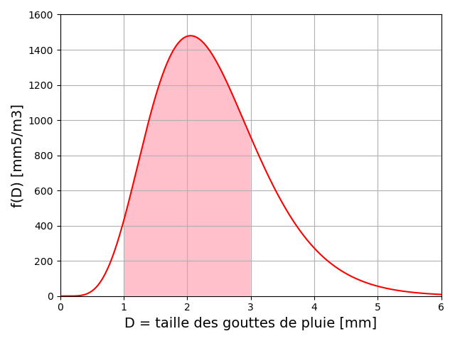
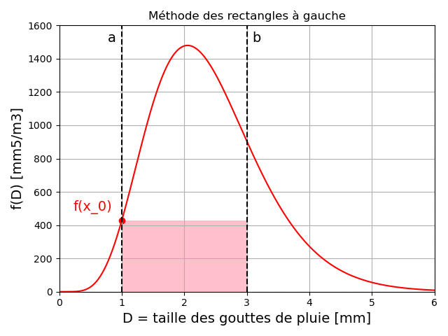
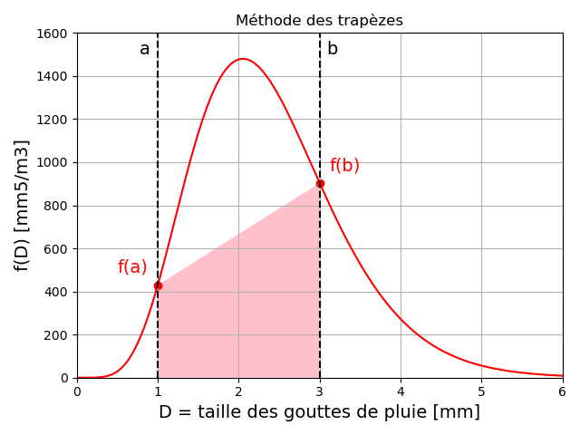
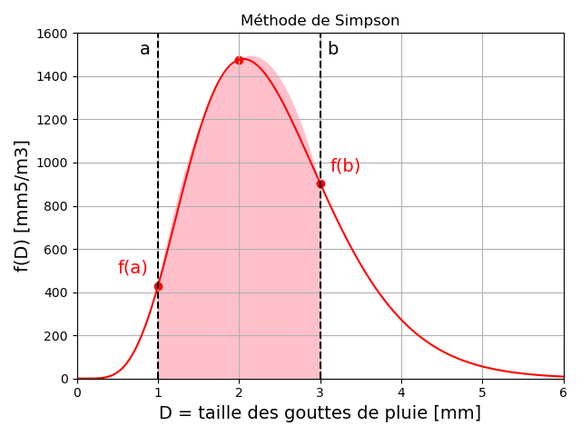
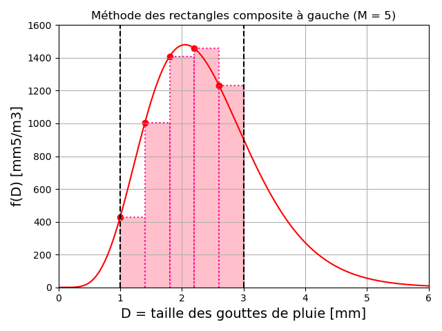
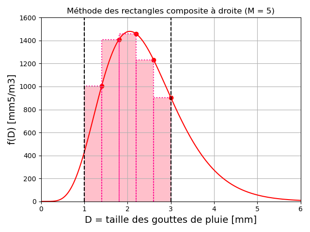
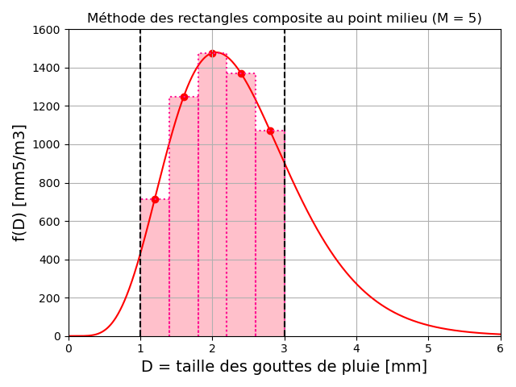
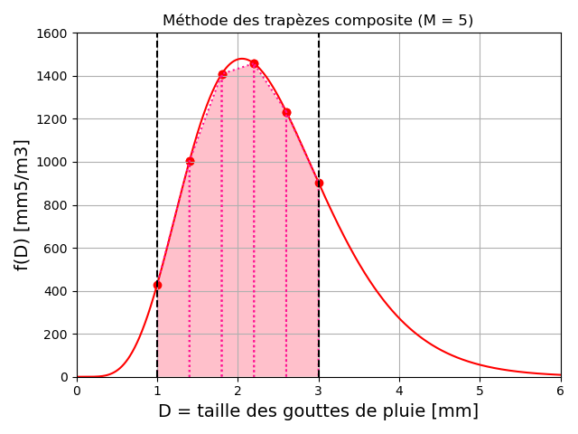
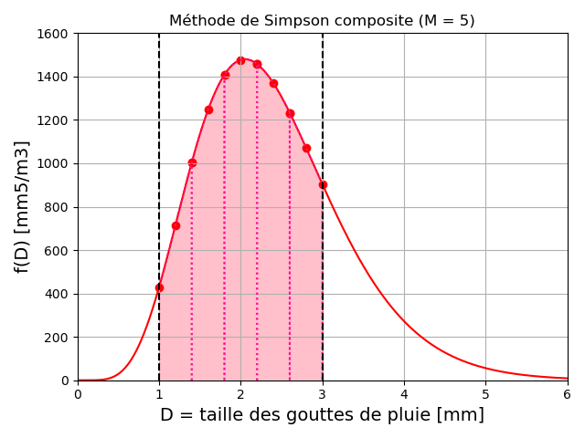

# Chapitre IV : Intégration numérique

Ce chapitre porte sur les méthodes numériques pour l'approximation de l'intégrale d'une fonction.

---

## Position du problème

### Motivation

Le but de l'intégration numérique est d'évaluer la valeur de l'**intégrale** $I$ d'une fonction $f$ continue sur un intervalle $[a,b]$ avec $a<b$ réels :

$I = \int_{a}^{b} f(x) dx$

On rappelle que cette intégrale représente l'**aire** comprise entre la courbe de la fonction, l'axe des abscisses, et les droites $x=a$ et $x=b$.

$I$ est une intégrale **définie** dont le résultat est un scalaire.
La fonction $f$ peut être connue qu'en certains points, mais ne dispose pas de singularité sur $[a,b]$, qui est supposé **fini et fermé**.

Dans certains cas limités, l'intégrale peut être calculée analytiquement, à partir de la **primitive** de $f$, notée $F$ :

$I = \int_{a}^{b} f(x) dx = F(b)-F(a)$

Cependant, ce calcul peut être long et compliqué, et beaucoup de fonctions ne disposent pas d'expression analytique pour leurs primitives.
On préfèrera faire appel à des méthodes numérique pour calculer une valeur approchée de $I$.

L'approximation de $I$ s'effectue le plus souvent à l'aide de combinaisons linéaires des valeurs de $f$ : des **formules de quadrature de type interpolation**.

L'intégrale $I$ est remplacée par une somme finie : $I \approx \sum_{i=0}^{n} w_i f(x_i)$.

### Exemple de problème

Au cours de ce chapitre, nous appliquerons les différentes méthodes d'intégration à un même exemple : **La modélisation de la réfléctivité radar des gouttes de pluies**.

En 1948, Marshall et Palmer ont proposé un modèle du facteur de réflectivité des gouttes de pluies $Z$ (en $mm^6 m^{-3}$) pour les radars météorologiques :

$Z = \int_{D_{min}}^{D_{max}} N_0 e^{- \Lambda D} D^6 dD$

Les paramètres de ce modèle sont :

- $D_{min}$ la plus petite taille de goutte, que nous fixerons à $1 mm$.

- $D_{max}$ la plus grande taille de goutte, que nous fixerons à $3 mm$.

- $\Lambda$ une constante empirique en $mm^{-1}$, pour laquelle Marshall et Palmer proposent $4.1 R^{-0.21}$, avec $R$ le taux de pluie que nous fixerons à $5 mm.h^{-1}$.

- $N_0$ une constante empirique en $m^{-3} mm^{-1}$ nommée "paramètre de forme", pour lequel Marshall et Palmer proposent $N_0 = 8000$.

Ce modèle est encore aujourd'hui utilisé pour l'interprétation des mesures des radars météorologiques, dans le but d'estimer les précipitations aux sol à partir des réflectivités mesurées.

Afin d'estimer la réflectivité $Z$ liée aux gouttes de pluie entre 1 et 3 cm, nous essayerons ici de calculer l'intégrale entre $x=1$ et $x=3$ de la fonction $f(x) = N_0 e^{- \Lambda x} x^6$, dont la valeur est d'environ $2337.49 mm^6/m^3$.

Sous Python on utilisera la bibliothèque Numpy :

~~~
import numpy as np
~~~

Puis, on définira les variables globales suivantes :

~~~
N0 = 8000 #Paramètre de forme (m3/mm)
R = 5 #Taux de pluie (mm/h)
~~~

La fonction $f$ sera définie comme :

~~~
def f(D):
    
    return N0*np.exp(-(4.1*R**-0.21)*D)*D**6
~~~

## Formules de quadrature

### Principe

|Idée|
|:-|
|Approcher la fonction $f$ par un polynôme $p$.|
|Si cette approximation est suffisamment bonne :|
|$I = \int_{a}^{b} f(x) dx \approx \int_{a}^{b} p(x) dx$|

Cette approche a 2 avantages :

- Les polynômes sont faciles à intégrer.

- Cette méthode est utilisable même si on ne connait $f$ qu'en un nombre fini de points $(x_i,f(x_i))$.

Les méthodes de Newton-Cotes et de Gauss s'appuient sur cette idée en utilisant des **formules de quadrature de type interpolation**, qui s'expriment comme une **combinaison linéaire de valeurs de la fonction en des points à définir**.

On cherche donc une valeur approchée de $I$ au moyen d'une somme finie :

$I = \int_{a}^{b} f(x) dx \approx I_n = \sum_{a}^{b} w_i f(x_i)$

On dit que $I_n$ est une **formule de quadrature de type interpolation à $n+1$ points**

Les valeurs $x_i$ sont les "**pivots**" ou "points / noeuds de quadrature".

Les coefficients $w_i$ sont les "**poids**" de la formule de quadrature.

### Formules de type interpolation

Soient $(x_i,f(x_i))$ avec $i=0,1,...,n+1$ points d'interpolation.
Un choix naturel consiste à approximer la fonction $f$ par le **polynôme de Lagrange de degré $\leq n$** qui passe par ces $n+1$ points :

$f(x) \approx p(x) = \sum_{i=0}^{n} f(x_i) L_i(x)$

Il en résulte la **formule de quadrature de type interpolation à $n+1$ points** :

$I = \int_{a}^{b} f(x) dx \approx I_n = \int_{a}^{b} p(x) dx = \int_{a}^{b} \sum_{i=0}^{n} f(x_i) L_i(x) dx$

Par linéarité de l'intégrale, on obtient les coefficients de la formule de quadrature :

$I_n = \sum_{i=0}^{n} f(x_i) \int_{a}^{b} L_i(x) dx$

D'où : $w_i = \int_{a}^{b} L_i(x) dx$

Les poids $w_i$ s'obtiennent par **intégration des polynômes de Lagrange**.
Ils sont donc indépendants de $f$ et ne dépendent que des points $x_i$.

### Degré de précision

On définit l'**erreur de troncation** pour l'intégration comme :

$E(f) = I-I_n$

Une formule de quadrature est dite **exacte** pour $f$ si $E(f)=0$.

|Degré de précision|
|:-|
|Le degré de précision d'une formule de quadrature est l'entier positif $n$ tel que $E(p_i)=0$ pour tout polynôme de degré $i \leq n$ et $E(p_{n+1}) \neq 0$ pour un polynôme $p_{n+1}$ de degré $n+1$.|

Donc une formule de quadrature exacte sur l'ensemble des polynômes de degré $\leq n$ est au moins de degré de précision $n$.

Autrement dit, une formule de quadrature de degré de précision $n$ vérifie :

- $I = \int_{a}^{b} p_k(x) dx = \int_{a}^{b} x^k dx = I_n = \sum_{i=0}^{n} w_i x_i^k$ pour tout $0 < k \leq n$

- $I = \int_{a}^{b} p_{n+1}(x) dx = \int_{a}^{b} x^{n+1} dx \neq I_n = \sum_{i=0}^{n} w_i x_i^{n+1}$

|Théorème|
|:-|
|Une formule de quadrature à $n+1$ points est exacte sur l'ensemble des polynômes de degré $\leq n$|
|si est seulement si c'est une formule de quadrature de type interpolation à $n+1$ points.|

Donc une formule de quadrature de type interpolation à $n+1$ points est au moins de degré de précision $n$.

## Méthodes de Newton-cotes simples

Les méthodes de Newton-Cotes s'appuient sur la formule de quadrature de type interpolation de Lagrange :

$I = \int_{a}^{b} f(x) dx = I_n + E(f) = \sum_{i=0}^{n} f(x_i) \int_{a}^{b} L_i(x) dx + E(f)$

où $E(f)$ est l'erreur de troncature.

Les pivots de quadrature sont **régulièrement espacés** :

$x_i = x_0 + ih$ avec $i=0,1,...,n$ et $h = \frac{b-a}{n}$

Les pivots sont donc **fixes** (équidistants) alors que les poids sont **ajustés**.

La régularité de la subdivision permet d'obtenir des formules qui sont très générales.

Il y a $n+1$ pivots donc cette méthode est **exacte pour les polynômes de degré $\leq n$ au moins**.

### Méthode des rectangles (n=0)

Lorsque l'on ne dispose que d'un seul point $(x_0,f(x_0))$, on peut utiliser la **formule des rectangles** :

$I = \int_{a}^{b} f(x) dx \approx I_0 = \int_{a}^{b} f(x_0) dx = (b-a) f(x_0)$

On donnera différents noms à la méthode suivant le choix de $x_0$ :

- "A gauche" : si on choisit $x_0 = a$.

- "A droite" : si on choisit $x_0 = b$.

- "Au point milieu" : si on choisit $x_0 = \frac{a+b}{2}$

On remarque que $I_0$ est l'**aire du rectangle** de largeur $b-a$ et de longueur $f(x_0)$.

Voici pour illustration l'aire de ce rectangle dans le cas de notre exemple :

Les formules des rectangles **à droite** et **à gauche** sont exactes pour des polynômes de degré 0 uniquement : leur **degré de précision est de 0**.

La formule au point milieu est aussi exacte pour les fonctions affines car elle exploite les symétries du problème : son **degré de précision est de 1**.

Si $f$ est continue et 2 fois dérivable sur $[a,b]$, alors il existe $\xi \in ]a,b[$ tel que $I = I_0 + E(f)$ avec :

$\begin{cases}
E(f) = \frac{(b-a)^2}{2} f'(\xi) = \frac{h^2}{2} f'(\xi) \; si \; x_0 = a \; ou \; x_0 = b \\
E(f) = \frac{(b-a)^3}{24} f"(\xi) = \frac{h^3}{24} f"(\xi) \; si \; x_0 = \frac{a+b}{2}
\end{cases}$

On en déduit que :

- Donc plus $[a,b]$ est petit, plus l'erreur est faible.

- Pour les formules à droite et à gauche, l'erreur décroit en $h^2$.

- Pour la formule au point milieu, l'erreur décroit en $h^3$.

- Plus les variations de $f$ sont limitées ($f'$ faible), plus l'erreur est faible pour les méthodes à droite et à gauche.

### Méthode des trapèzes (n=1)

Lorsque l'on dispose que de 2 points $(x_0,f(x_0))$ et $(x_1,f(x_1))$, on peut utiliser la **formule des trapèzes** :

$I = \int_{a}^{b} f(x) dx \approx I_1 = \frac{(b-a)}{2} (f(a)+f(b))$

$I_1$ est une formule de quadrature de type interpolation à 2 points.

On remarque qu'elle correspond à l'**aire d'un trapèze**.

Voici pour illustration l'aire de ce trapèze dans le cas de notre exemple :

Si $f$ est continue et 2 fois dérivable sur $[a,b]$, alors il existe $\xi \in ]a,b[$ tel que $I = I_1 + E(f)$ avec :

$E(f) = - \frac{h^3}{12} f"(\xi)$

La méthode des trapèzes est exacte sur l'espace des polynômes de degré $\leq 1$ donc de **degré de précision 1**.  

Par contre, elle est 2X plus lente que la méthode des rectangles au point milieu pour le même degré de précision.

### Méthode de Simpson (n=2)

Lorsque l'on dispose que de 3 points $(x_0,f(x_0))$, $(x_1,f(x_1))$ et $(x_2,f(x_2))$, on peut utiliser la **formule de Simpson**.

Si on choisit $x_0 = a$, $x_1 = \frac{a+b}{2}$ et $x_2 = b$ :

$I = \int_{a}^{b} f(x) dx \approx I_2 = \frac{(b-a)}{6} (f(a)+4 f(\frac{a+b}{2})+f(b))$

$I_2$ est une formule de quadrature de type interpolation à 3 points.

On remarque qu'elle correspond à l'**aire sous un morceau de parabole**.

Voici pour illustration l'aire sous la parabole dans le cas de notre exemple :

Si $f$ est continue et 4 fois dérivable sur $[a,b]$, alors il existe $\xi \in ]a,b[$ tel que $I = I_2 + E(f)$ avec :

$E(f) = - \frac{h^5}{90} f^{(4)}(\xi)$

La méthode de Simpson est exacte sur l'espace des polynômes de degré $\leq 2$ donc de **degré de précision 3**.

Elle nécessite l'évaluation de $f$ en 3 points, mais l'erreur diminue rapidement, en $h^5$.

### Méthodes de Newton-Cotes (n>0)

On peut généraliser les formule de quadrature de type interpolation de Lagrange à tout degré $n>0$.
On parle alors de **méthodes de Newton-Cotes** de manière générale.

On distingue 2 formules suivant si $n$ est pair ou impair :

|Cas de $n$ **impair**|
|:-|
|Si $f$ est dérivable $n+1$ fois sur $[a,b]$, alors il existe un réel $K$ et $\xi \in ]a,b[$ tel que|
|$E(f) = \frac{K}{(n+1)!} (b-a)^{n+2} f^{(n+1)}(\xi)$|
|Le degré de précision est $n$.|

|Cas de $n$ **pair**|
|:-|
|Si $f$ est dérivable $n+2$ fois sur $[a,b]$, alors il existe un réel $K$ et $\xi \in ]a,b[$ tel que|
|$E(f) = \frac{K}{(n+2)!} (b-a)^{n+3} f^{(n+2)}(\xi)$|
|Le degré de précision est $n+1$.|

On peut en conclure qu'une **formule centrée** ($n$ pair, donc nombre de points impair) est préférable.

Voici les formules des méthodes de Newton-Cotes jusqu'à $n=6$ :

|Degré $n$|Nom                        |Formule                                                                             |
|:--------|:--------------------------|:----------------------------------------------------------------------------------:|
|1        |Méthode des trapèzes       |$\frac{b-a}{2}(f(x_0)+f(x_1))$                                                      |
|2        |Méthode de Simpson 1/3     |$\frac{b-a}{6}(f(x_0)+4f(x_1)+f(x_2))$                                              |
|3        |Méthode de Simpson 3/8     |$\frac{b-a}{8}(f(x_0)+3f(x_1)+3f(x_2)+f(x_3))$                                      |
|4        |Méthode de Boole-Villarceau|$\frac{b-a}{90}(7f(x_0)+32f(x_1)+12f(x_2)+32f(x_3)+7f(x_4))$                        |
|6        |Méthode de Weddle-Hardy    |$\frac{b-a}{840}(41f(x_0)+216f(x_1)+27f(x_2)+272f(x_3)+27f(x_4)+216f(x_5)+41f(x_6))$|

En pratique, les méthodes de Newton-Cotes ne sont **presque jamais utilisées pour $n>6$**.

### Algorithmes

Voici les différentes méthodes de Newton-Cotes présentées précédemment sous la forme de fonctions Python.

Elles prennent toutes en entrée :

* `f` la fonction Python à intégrer.

* `a` la borne inférieure de l'intervalle d'intégration.

* `b` la borne supérieure de l'intervalle d'intégration.

La fonction pour la méthode des rectangles à gauche :

~~~
def rectangles_gauche(f,a,b):
    
    return (b-a)*f(a)
~~~

La fonction pour la méthode des rectangles à droite :

~~~
def rectangles_droite(f,a,b):
    
    return (b-a)*f(b)
~~~

La fonction pour la méthode des rectangles au point milieu :

~~~
def rectangles_milieu(f,a,b):
    
    return (b-a)*f((a+b)/2)
~~~

La fonction pour la méthode des trapèzes :

~~~
def trapezes(f,a,b):
    
    return (b-a)*(f(a)+f(b))/2
~~~

La fonction pour la méthode de Simpson :

~~~
def simpson(f,a,b):
    
    return (b-a)*(f(a)+4*f((a+b)/2)+f(b))/6
~~~

### Exemple

En appliquant les algorithmes précédents à notre problème exemple, on trouve les valeurs suivantes :

|Méthode                   |Estimation de Z ($mm^6 m^{-3}$)|
|:-------------------------|:-----------------------------:|
|Rectangles à gauche       |859.36                         |
|Rectangles à droite       |1807.24                        |
|Rectangles au point milieu|2954.01                        |
|Trapèzes                  |1333.30                        |
|Simpson                   |2413.78                        |

Ces estimations sont à comparer à la valeur théorique $Z = 2337.49 mm^6/m^3$.

**Exercice :**

Déterminez la formule de Newton-Cotes pour $n=4$ (aussi appellée "méthode de Boole-Villarceau"), et implémentez-là sous la forme d'une fonction Python.
Quelle estimation de $Z$ obtenez-vous ? Cette valeur est-elle plus proche du résultat attendu ? Ce résultat était-il attendu ?

## Méthode de Newton-Cotes composites

Pour améliorer la précision des méthode de Newton-Cotes, on pourrai augmenter le nombre de point d'intégration, et donc le degré du polynôme d'interpolation.
Mais cela conduit à des formules de plus en plus complexes, et même potentiellement à un phénomène de Runge (voir le Chapitre 3).

C'est pourquoi on utilise en général des méthodes composites avec des formules de Newton-Cotes de degré $n<6$.

L'idée des formules composites est la suivante :

- Découper l'intervalle $[a,b]$ en $M$ sous-intervalles.

- Appliquer une formule de Newton-Cotes sur chaque sous-intervalle pour estimer l'aire sous la courbe.

- Additionner les aires estimées pour chaque sous-intervalle.

Ceci revient à l'expression suivante de l'intégrale :

$I = \int_{a}^{b} f(x) dx = \displaystyle\sum_{j=0}^{M} \int_{x_{j-1}=a+(j-1)h}^{x_j=a+jh} f(x) dx$

Dans ce cas, les points de subdivision sont régulièrement espacés d'un pas $h=\frac{b-a}{M}$.

Une **formule de quadrature de type interpolation composite** s'écrit donc :

$I_{n,M} = \displaystyle\sum_{j=1}^{M} \displaystyle\sum_{i=0}^{n} w_i^{(j)} f(x_i^{(j)})$

### Formule composite des rectangles

Soit $M+1$ points de discrétisation $(x_j,f(x_j))$ avec $x_j=a+jh$ et $h=\frac{b-a}{M}$.

**Rectangles à gauche :**

Sur chaque sous-intervalle $[x_j,x_{j+1}]$ :

$\int_{x_{j+1}}^{x_j} f(x) dx \approx hf(x_{j})$

D'où la formule composite des rectangles à gauche :

$\int_{a}^{b} f(x) dx \approx h(\displaystyle\sum_{j=0}^{M-1} f(x_{j}))$

Voici une illustration pour notre exemple, avec $M=5$ :

**Rectangles à droite :**

Sur chaque sous-intervalle $[x_j,x_{j+1}]$ :

$\int_{x_{j+1}}^{x_j} f(x) dx \approx hf(x_{j+1})$

D'où la formule composite des rectangles à droite :

$\int_{a}^{b} f(x) dx \approx h(\displaystyle\sum_{j=0}^{M-1} f(x_{j+1}))$

Voici une illustration pour notre exemple, avec $M=5$ :

**Rectangles au point milieu :**

Sur chaque sous-intervalle $[x_j,x_{j+1}]$ :

$\int_{x_{j+1}}^{x_j} f(x) dx \approx hf(\frac{x_{j}+x_{j+1}}{2})$

D'où la formule composite des rectangles au point milieu :

$\int_{a}^{b} f(x) dx \approx h(\displaystyle\sum_{j=0}^{M-1} f(\frac{x_{j}+x_{j+1}}{2}))$

Voici une illustration pour notre exemple, avec $M=5$ :

Ces formules nécessitent $M$ évaluations de $f$.

On peut alors montrer que dans le cas du point milieu, l'erreur est majorée ainsi :

$\mid E(f) \mid \leq \frac{b-a}{24} h^2 max_{x \in [a,b]} \mid f"(x) \mid$

On observe que $\lim\limits_{M \rightarrow \infty} E(f) = \lim\limits_{h \rightarrow 0} E(f) = 0$.

On en déduit que la méthode converge bien vers la valeur exacte de l'intégrale.

L'ordre de convergence est de 2 : **l'erreur est divisée par 4 lorsque h est divisé par 2**.

### Formule composite des trapèzes

Sur chaque sous-intervalle $[x_j,x_{j+1}]$ :

$\int_{x_{j+1}}^{x_j} f(x) dx \approx \frac{h}{2} (f(x_{j})+f(x_{j+1}))$

D'où la formule composite des trapèzes :

$\int_{a}^{b} f(x) dx \approx h (\frac{1}{2} f(a) + \displaystyle\sum_{j=1}^{M-1} f(x_j) + \frac{1}{2} f(b))$

Voici une illustration pour notre exemple, avec $M=5$ :

Cette formule nécessite $M+1$ évaluations de $f$.

On peut montrer que l'erreur est majorée ainsi :

$\mid E(f) \mid \leq \frac{b-a}{12} h^2 max_{x \in [a,b]} \mid f"(x) \mid$

On observe que $\lim\limits_{M \rightarrow \infty} E(f) = \lim\limits_{h \rightarrow 0} E(f) = 0$.

On en déduit que la méthode converge bien vers la valeur exacte de l'intégrale.

L'ordre de convergence est de 2 : **l'erreur est divisée par 4 lorsque h est divisé par 2**.

### Formule composite de Simpson

Pour faciliter l'écriture, on définira pour la méthode de Simpson composite $h = \frac{b-a}{2M} pour un nombre d'intervalles $M$.

Sur chaque sous-intervalle $[x_j,x_{j+2}]$ :

$\int_{x_{j+2}}^{x_j} f(x) dx \approx \frac{h}{3} (f(x_{j})+4f(x_{j+1})+f(x_{j+2}))$

D'où la formule composite de Simpson :

$\int_{a}^{b} f(x) dx \approx \frac{h}{3} (f(a) + 2 \displaystyle\sum_{j=1}^{M-1} f(x_{2j}) + 4 \displaystyle\sum_{j=1}^{M-1} f(x_{2j-1}) + f(b))$

Voici une illustration pour notre exemple, avec $M=5$ :

Cette formule nécessite $2M+1$ évaluations de $f$.

On peut montrer que l'erreur est majorée ainsi :

$\mid E(f) \mid \leq \frac{b-a}{90} h^4 max_{x \in [a,b]} \mid f^{(4)}(x) \mid$

On observe que $\lim\limits_{M \rightarrow \infty} E(f) = \lim\limits_{h \rightarrow 0} E(f) = 0$.

On en déduit que la méthode converge bien vers la valeur exacte de l'intégrale.

L'ordre de convergence est de 4 : **l'erreur est divisée par 16 lorsque h est divisé par 2**.

### Algorithmes

Voici une fonction Python pour calculer une intégrale à partir des méthodes simples programmées précédemment.

Elle prend en entrée :

* `f` la fonction Python à intégrer.

* `a` la borne inférieure de l'intervalle d'intégration.

* `b` la borne supérieure de l'intervalle d'intégration.

* `methode` la méthode d'intégration (rectangles, trapèzes ou Simpson) sous la forme d'une fonction Python.

* `M` le nombre d'intervalles d'intégration.

~~~
def methode_composite(f,a,b,methode,M):
    
    #Découpage de l'intervalle [a,b] en M sous-intervalles avec un pas de 
    #(b-a)/M :
    x_i = [a+i*(b-a)/M for i in range(M+1)]
    
    #Initialisation de la somme des aires sous la courbe des différents 
    #sous-intervalles :
    somme = 0 
    
    #Boucle sur les sous-intervalles :
    for i in range(M):
              
        #Addition au compteur de l'aire sous la courbe pour ce sous-intervalle :
        somme += methode(f,x_i[i],x_i[i+1])
    
    #Renvoyer l'estimation de l'aire sous la courbe pour l'intervalle [a,b] :
    return somme
~~~

Si cette fonction est élégante, car elle est utilisable pour toutes les méthodes programmées précédemment, il est à noter qu'elle n'est pas optimisée pour la méthode des trapèzes et la méthode de Simpson.
En effet, avec cette implémentation, on évalue plusieurs fois la fonction aux mêmes points.

Pour une implémentation plus optimisée, il vaut mieux programmer une fonction pour chaque méthode composite, en se basant sur les formules données précédemment :

### Exemples

### Accélération de Romberg

## Méthodes de Gauss

### Principe

### Méthode à 1 point

### Méthode à 2 points