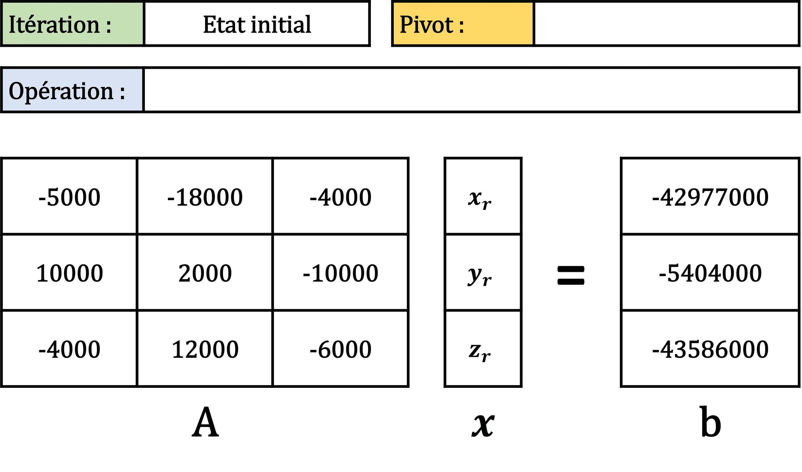

# Chapitre V : Résolution de systèmes d'équations linéaires

Ce chapitre porte sur les méthodes numériques pour la résolution d'un système linéaire d'équations.

---

## Position du problème

### Motivation

Notre but est de résoudre un **système linéaire** : un ensemble d'équations portant sur les mêmes inconnues.

Un système de $m$ équations linéaires à $n$ inconnues peut s'écrire sous la forme suivante :

$\begin{cases}
a_{1,1} x_1 + a_{1,2} x_2 + ... + a_{1,n} x_n = b_1\\
a_{2,1} x_1 + a_{2,2} x_2 + ... + a_{2,n} x_n = b_2\\
...\\
a_{m,1} x_1 + a_{m,2} x_2 + ... + a_{m,n} x_n = b_m
\end{cases}$

avec $x_1,x_2,...,x_n$ les **inconnues** et $a_{i,j}$ les **coefficients** du système.

On peut également écrire ce système sous forme matricielle :

$A x = b$

avec $A$ une matrice de coefficients réels de taille $m \times n$, $x$ est un vecteur de taille $n$ contenant les variables réelles recherchées, et $b$ est un vecteur contenant $m$ réels.

$A = 
 \begin{pmatrix}
  a_{1,1} & a_{1,2} & \cdots & a_{1,n} \\
  a_{2,1} & a_{2,2} & \cdots & a_{2,n} \\
  \vdots  & \vdots  & \ddots & \vdots  \\
  a_{m,1} & a_{m,2} &\cdots & a_{m,n} 
 \end{pmatrix}$
 
$x =
 \begin{pmatrix}
  x_1\\
  x_2\\
  \vdots\\
  x_n 
 \end{pmatrix}$
 
$b =
 \begin{pmatrix}
  b_1\\
  b_2\\
  \vdots\\
  b_n 
 \end{pmatrix}$
 
Si $m>n$, on dit le système **sur-déterminé**.
Si $m<n$, on dit le système **sous-déterminé**.

### Solution, rang et déterminant

Face à un système linéaire, il y a 3 cas possibles :

- Le système n'a pas de solution.
- Le système a une infinité de solution.
- Le système a une solution unique.

On peut savoir dans quel cas on se trouve avec le **rang de la matrice $A$**.

|Définition|
|:-|
|Le **rang** d'une matrice $A$ est le nombre de vecteurs lignes ou colonnes linéairement indépendants.|

Si $A$ est de dimensions $m \times n$, alors $rang(A) \leq min(m,n)$.

|Théorème de Rouché-Fontené|
|:-|
|Le système linéaire $A x = b$ avec|
|$A$ une matrice de taille $m \times n$,|
|$x$ un vecteur de taille $n$,|
|et $b$ un vecteur de taille $m$,|
|admet une solution **si et seulement si** :|
|$rang(A) = rang([A \mid b])$|
|Si de plus, $rang(A) = n$, alors le système admet une **unique solution**.|
|Sinon, le système admet une infinité de solutions.|

Dans le cas où la matrice $A$ est carrée, on a même le théorème suivant :

|Théorème|
|:-|
|Lorsque la matrice $A$ est carrée de dimension $n \times n$,|
|avec $n$ la taille du vecteur $x$,|
|le système linéaire $A x = b$ admet une **unique solution** si et seulement si :|
|le **déterminant de $A$** noté $det(A)$ est non nul.|
|($A$ est alors inversible, et on note $A^{-1}$ son inverse)|

On dit alors que le **système est de Cramer** et on peut écrire :

$x = A^{-1} b$

Le **système homogène** $A x = 0$ admet toujours le vecteur nul comme solution :

- Si $det(A) \neq 0$ c'est l'unique solution. 

- Sinon il y en a une infinité.

Dans le cas d'un **système non homogène** ($b \neq 0$), si $det(A) = 0$ :

- Soit $rang(A) = rang([A \ mid b])$ alors il y a une infinité de solutions.

- Soit $rang(A) \neq rang([A \mid b])$ alors il n'y a pas de solution.

### Conditionnement

Même quand un système linéaire admet une solution unique, cette solution peut ne pas être "stable".

Un système est dit "**mal conditionné**" si la solution est extrêmement sensible aux perturbations des coefficients $A + \Delta A$ et des seconds membres $b + \Delta b$.

Un déterminant petit est souvent indicateur d'un mauvais conditionnement.

Pour quantifier la sensibilité de l'erreur relative sur la solution du système linéaire $A x = b$ aux variation de $A$ et $b$, on peut estimer le **conditionnement de la matrice A** :

$\kappa(A) = \|A\| \|A^{-1}\|$

avec une norme matricielle à définir.

L'erreur relative sur la solution est inférieure à l'erreur relative sur les données multiplisée par $\kappa(A)$ :

- Si $\kappa(A)$ est petit (de l'ordre de l'unité) on dit que le conditionnement est bon.

- Si $\kappa(A) >> 1$ le système est dit mal conditionné.

Le calcul du conditionnement dépend du choix de la norme :

- La **norme infinie** : $\|A\|_{\infty} = max_{1 \leq i \leq n} \displaystyle\sum_{j=1}^{n} |a_{i,j}|$

- La **norme 1** : $\|A\|_1 = max_{1 \leq j \leq n} \displaystyle\sum_{i=1}^{n} |a_{i,j}|$

- La **norme 2** : $\|A\|_2 = \|A^T\|_2 = \sqrt{\rho(A A^T)} = \sqrt{\rho(A^T A)}$

$\rho(A)$ est le **rayon spectral** de $A$, que l'on définit comme : 
$\rho(A) = max_{1 \leq i \leq n} |\lambda_i|$
avec $\lambda_i$ les **valeurs propres** de $A$.

On utilisera surtout le conditionnement de $A$ au sens de la norme 1 et de la norme 2 :

$\kappa_1(A) = \|A\|_1 \|A^{-1}\|_1$

$\kappa_2(A) = \|A\|_2 \|A^{-1}\|_2$

Pour une matrice carrée $A$ d'ordre $n$ inversible, le conditionnement vérifie les propriétés suivantes :

- $\kappa(A) \geq 1$

- $\forall \alpha \in \mathbb{R}$, $\kappa(\alpha A) = \kappa(A)$

- $\kappa(A) = \kappa(A^{-1})$

- Si on note $\sigma_{min}^2$ et $\sigma_{max}^2$ la plus petite et la plus grande valeur propre de $A A^T$ : $\kappa_2(A) = \frac{\sigma_{max}}{\sigma_{min}}$

- Si $A$ est une matrice **réelle symétrique** ($A = A^T$), si $\lambda_{min}$ et $\lambda_{max}$ sont la plus petite et la plus grande valeur propre de $A$ en valeur absolue, on a : $\kappa_2(A) = \mid \frac{\lambda_{max}}{\lambda_{min}} \mid$

- Si $A$ est une matrice **orthogonale** ($A A^T = A^T A = I$) alors $\kappa_2(A) = 1$

|Effet d'une perturbation de $b$|
|:-|
|Si on a une perturbation $\Delta b$ sur $b$ induisant une erreur $\Delta x$ sur $x$, alors on aura la majoration :|
|$\frac{\Vert \Delta x \Vert}{\Vert x \Vert} \leq \kappa(A) \frac{\Vert \Delta b \Vert}{\Vert b \Vert}$|

|Effet d'une perturbation de $A$|
|:-|
|Si on a une perturbation $\Delta A$ sur $A$ induisant une erreur $\Delta x$ sur $x$, alors on aura la majoration :|
|$\frac{\Vert \Delta x \Vert}{\Vert x + \Delta x \Vert} \leq \kappa(A) \frac{\Vert \Delta A \Vert}{\Vert A \Vert}$|

### Exemple de problème

Au cours de ce chapitre, nous appliquerons les différentes méthodes d'intégration à un même exemple : **Le positionnement par satellites GPS**.

Nous exprimerons ici les positions en km, avec des coordonnées dans le repère cartésien ECEF (Earth-Centered Earth-Fixed), ayant pour origine le centre de la Terre.

* Soit un récepteur au sol dont on veut connaitre la position $(x_r,y_r,z_r)$ dans ce repère cartésien.

* Soient 4 satellites de la constellation GPS, dont la position est connue dans ce même repère : $(x_{s1},y_{s1},z_{s1})$, $(x_{s2},y_{s2},z_{s2})$, $(x_{s3},y_{s3},z_{s3})$ and $(x_{s4},y_{s4},z_{s4})$.

* Chaque satellite émet un signal, qui est reçu avec un certain temps de retard par le récepteur. Ces temps de retard $(t_1,t_2,t_3,t_4)$ sont mesurés par le récepteur.

* On admet que les signaux émis par chaque satellite se déplacent à vitesse constante jusqu'au récepteur : $c = 3.10^5 km/s$.

La distance euclidienne entre chaque satellite et le récepteur doit être égale au temps de retard du signal multiplié par sa vitesse.
On en déduit facilement que les différentes variables sont liées par le système de 4 équations suivant :

$\begin{cases}
(x_r-x_{s1})^2 + (y_r-y_{s1})^2 + (z_r-z_{s1})^2 = (c t_1)^2\\
(x_r-x_{s2})^2 + (y_r-y_{s2})^2 + (z_r-z_{s2})^2 = (c t_2)^2\\
(x_r-x_{s3})^2 + (y_r-y_{s3})^2 + (z_r-z_{s3})^2 = (c t_3)^2\\
(x_r-x_{s4})^2 + (y_r-y_{s4})^2 + (z_r-z_{s4})^2 = (c t_4)^2
\end{cases}$

Que l'on peut développer :

$\begin{cases}
x_r^2 - 2 x_{s1} x_r + x_{s1}^2 + y_r^2 - 2 y_{s1} y_r + y_{s1}^2 + z_r^2 - 2 z_{s1} z_r + z_{s1}^2 = (c t_1)^2\\
x_r^2 - 2 x_{s2} x_r + x_{s2}^2 + y_r^2 - 2 y_{s2} y_r + y_{s2}^2 + z_r^2 - 2 z_{s2} z_r + z_{s2}^2 = (c t_2)^2\\
x_r^2 - 2 x_{s3} x_r + x_{s3}^2 + y_r^2 - 2 y_{s3} y_r + y_{s3}^2 + z_r^2 - 2 z_{s3} z_r + z_{s3}^2 = (c t_3)^2\\
x_r^2 - 2 x_{s4} x_r + x_{s4}^2 + y_r^2 - 2 y_{s4} y_r + y_{s4}^2 + z_r^2 - 2 z_{s4} z_r + z_{s4}^2 = (c t_4)^2
\end{cases}$

En soustrayant la 1ère équation aux 3 autres, on réduit le système à 3 équations :

$\begin{cases}
x_{s2}^2 + y_{s2}^2 + z_{s2}^2 - 2 x_{s2} x_r - 2 y_{s2} y_r - 2 z_{s2} z_r - x_{s1}^2 - y_{s1}^2 - z_{s1}^2 + 2 x_{s1} x_r + 2 y_{s1} y_r + 2 z_{s1} z_r = (c t_2)^2-(c t_1)^2\\
x_{s3}^2 + y_{s3}^2 + z_{s3}^2 - 2 x_{s3} x_r - 2 y_{s3} y_r - 2 z_{s3} z_r - x_{s1}^2 - y_{s1}^2 - z_{s1}^2 + 2 x_{s1} x_r + 2 y_{s1} y_r + 2 z_{s1} z_r = (c t_3)^2-(c t_1)^2\\
x_{s4}^2 + y_{s4}^2 + z_{s4}^2 - 2 x_{s4} x_r - 2 y_{s4} y_r - 2 z_{s4} z_r - x_{s1}^2 - y_{s1}^2 - z_{s1}^2 + 2 x_{s1} x_r + 2 y_{s1} y_r + 2 z_{s1} z_r = (c t_4)^2-(c t_1)^2
\end{cases}$

Qui revient en regroupant les termes :

$\begin{cases}
x_{s2}^2 - x_{s1}^2 + y_{s2}^2 - y_{s1}^2 + z_{s2}^2 - z_{s1}^2 - 2 (x_{s2}-x_{s1}) x_r - 2 (y_{s2}-y_{s1}) y_r - 2 (z_{s2}-z_{s1}) z_r = (c t_2)^2-(c t_1)^2\\
x_{s3}^2 - x_{s1}^2 + y_{s3}^2 - y_{s1}^2 + z_{s3}^2 - z_{s1}^2 - 2 (x_{s3}-x_{s1}) x_r - 2 (y_{s3}-y_{s1}) y_r - 2 (z_{s3}-z_{s1}) z_r = (c t_3)^2-(c t_1)^2\\
x_{s4}^2 - x_{s1}^2 + y_{s4}^2 - y_{s1}^2 + z_{s4}^2 - z_{s1}^2 - 2 (x_{s4}-x_{s1}) x_r - 2 (y_{s4}-y_{s1}) y_r - 2 (z_{s4}-z_{s1}) z_r = (c t_4)^2-(c t_1)^2
\end{cases}$

Et en réarrangeant on obtient finalement le système linéaire :

$\begin{cases}
(x_{s2}-x_{s1}) x_r + (y_{s2}-y_{s1}) y_r + (z_{s2}-z_{s1}) z_r = \frac{1}{2} (x_{s2}^2 - x_{s1}^2 + y_{s2}^2 - y_{s1}^2 + z_{s2}^2 - z_{s1}^2 - (c t_2)^2 + (c t_1)^2)\\
(x_{s3}-x_{s1}) x_r + (y_{s3}-y_{s1}) y_r + (z_{s3}-z_{s1}) z_r = \frac{1}{2} (x_{s3}^2 - x_{s1}^2 + y_{s3}^2 - y_{s1}^2 + z_{s3}^2 - z_{s1}^2 - (c t_3)^2 + (c t_1)^2)\\
(x_{s4}-x_{s1}) x_r + (y_{s4}-y_{s1}) y_r + (z_{s4}-z_{s1}) z_r = \frac{1}{2} (x_{s4}^2 - x_{s1}^2 + y_{s4}^2 - y_{s1}^2 + z_{s4}^2 - z_{s1}^2 - (c t_4)^2 + (c t_1)^2)
\end{cases}$

avec 3 équations et 3 inconnues $(x_r,y_r,z_r)$.

On peut écrire ce système sous la forme matricielle $A x = b$ :

$\begin{pmatrix}
  x_{s2}-x_{s1} & y_{s2}-y_{s1} & z_{s2}-z_{s1} \\
  x_{s3}-x_{s1} & y_{s3}-y_{s1} & z_{s3}-z_{s1} \\
  x_{s4}-x_{s1} & y_{s4}-y_{s1} & z_{s4}-z_{s1}
 \end{pmatrix}
 \begin{pmatrix}
  x_r\\
  y_r\\
  z_r 
 \end{pmatrix}
 =
 \begin{pmatrix}
  \frac{1}{2} (x_{s2}^2 - x_{s1}^2 + y_{s2}^2 - y_{s1}^2 + z_{s2}^2 - z_{s1}^2 - (c t_2)^2 + (c t_1)^2)\\
  \frac{1}{2} (x_{s3}^2 - x_{s1}^2 + y_{s3}^2 - y_{s1}^2 + z_{s3}^2 - z_{s1}^2 - (c t_3)^2 + (c t_1)^2)\\
  \frac{1}{2} (x_{s4}^2 - x_{s1}^2 + y_{s4}^2 - y_{s1}^2 + z_{s4}^2 - z_{s1}^2 - (c t_4)^2 + (c t_1)^2)
 \end{pmatrix}$ 

Admettons que le récepteur GPS se trouve aux coordonnées ECEF $(x_r,y_r,z_r) = (4205,158,4777)$, correspondant approximativement à la position de l'UFR des Sciences de l'UVSQ.

Si la position des 4 satellites est :

$(x_{s1},y_{s1},z_{s1}) = (14000,4000,25000)$
$(x_{s2},y_{s2},z_{s2}) = (9000,-14000,21000)$
$(x_{s3},y_{s3},z_{s3}) = (24000,6000,15000)$
$(x_{s4},y_{s4},z_{s4}) = (10000,16000,19000)$

Alors le temps de retard associé à chaque satellite sera approximativement :

$t_1 = 0.0759878 s$
$t_2 = 0.0735321 s$
$t_3 = 0.0767739 s$
$t_4 = 0.0735485 s$

(Il est à noter que les positions des satellites ont été choisies pour être réalistes des satellites GPS).

Le système devient alors :

$\begin{pmatrix}
  -5000 & -18000 & -4000 \\
  10000 & 2000 & -10000 \\
  -4000 & 12000 & -6000
 \end{pmatrix}
 \begin{pmatrix}
  x_r\\
  y_r\\
  z_r 
 \end{pmatrix}
 =
 \begin{pmatrix}
  -42977000\\
  -5404000\\
  -43586000
 \end{pmatrix}$ 
 
C'est ce système d'équations linéaires que nous chercherons à résoudre pour essayer de retrouver la position $(x_r,y_r,z_r)$ du récepteur.

On peut déjà vérifier que ce système a bien une unique racine :

- $A$ est carrée de dimensions $3 \times 3$, $x$ et $b$ sont de taille 3.

- $det(A) = (-5000 \times 2000 \times -6000) + (10000 \times 12000 \times -4000) + (-18000 \times -10000 \times -4000)$ 
$- (-4000 \times 2000 \times -4000) - (-5000 \times 12000 \times -10000) - (10000 \times -18000 \times -6000)$
$= -2852000000000 \neq 0$

Il s'agit donc d'un **système de Cramer** : on a bien **unicité de la solution**.

On peut également vérifier si le système est bien conditionné :

- $\kappa_1(A) \approx 5.03$

- $\kappa_2(A) \approx 2.36$

Dans les 2 cas, le conditionnement est de l'ordre de l'unité : un a donc un **bon conditionnement**.

Dans la suite de ce chapitre, on utilisera Numpy sous Python pour définir / manipuler les matrices $A$ et $b$ :

~~~
import numpy as np
~~~

On définira le vecteur de la position du récepteur GPS à retrouver avec :

~~~
pos_rec = np.array([4205,158,4777],dtype=np.float64)
~~~

On définira ensuite les vecteurs de positions des satellites GPS avec :

~~~
pos_sat1 = np.array([14000,4000,25000],dtype=np.float64) #Coordonnées du satellite GPS 1
pos_sat2 = np.array([9000,-14000,21000],dtype=np.float64) #Coordonnées du satellite GPS 2
pos_sat3 = np.array([24000,6000,15000],dtype=np.float64) #Coordonnées du satellite GPS 3
pos_sat4 = np.array([10000,16000,19000],dtype=np.float64) #Coordonnées du satellite GPS 4
~~~

On pourra alors en déduire les temps de retard associés :

~~~
t1 = ((sum((pos_rec-pos_sat1)**2))**0.5)/3e5 #Temps de retard associé au satellite GPS 1
t2 = ((sum((pos_rec-pos_sat2)**2))**0.5)/3e5 #Temps de retard associé au satellite GPS 2
t3 = ((sum((pos_rec-pos_sat3)**2))**0.5)/3e5 #Temps de retard associé au satellite GPS 3
t4 = ((sum((pos_rec-pos_sat4)**2))**0.5)/3e5 #Temps de retard associé au satellite GPS 4
~~~

Et pour finir, on pourra définir les matrices $A$ et $b$ du système linéaire à résoudre :

~~~
A = np.vstack((pos_sat2-pos_sat1,pos_sat3-pos_sat1,pos_sat4-pos_sat1))

b_row1 = 0.5*(sum(pos_sat2**2)-sum(pos_sat1**2)-(3e5*t2)**2+(3e5*t1)**2)
b_row2 = 0.5*(sum(pos_sat3**2)-sum(pos_sat1**2)-(3e5*t3)**2+(3e5*t1)**2)
b_row3 = 0.5*(sum(pos_sat4**2)-sum(pos_sat1**2)-(3e5*t4)**2+(3e5*t1)**2)

b = np.array([b_row1,b_row2,b_row3])
~~~

## La règle de Cramer

### Théorème

La **règle de Cramer** (ou méthode de Cramer) est un théorème d'algèbre linéaire qui donne la solution d'un système de Cramer :

|Théorème de la règle de Cramer|
|:-|
|Le système de Cramer $A x = b$ avec|
|$A$ matrice carrée de taille $n \times n$|
|$x$ vecteur de taille $n$|
|$b$ vecteur de taille $n$|
|admet une solution **si et seulement si** $A$ est inversible.|
|Cette solution est donnée par :|
|$x_i = \frac{det(A_i)}{det(A)}$ pour $i=1,...,n$|
|où $A_i$ est la matrice carrée formée en remplaçant la i-ème colonne de $A$ par le vecteur $b$.|

Lorsque le système n'est pas de Cramer (donc si $det(A)=0$) :

- Si le déterminant d'une des racines $A_i$ est nul alors le système n'a pas de solution.

- La réciproque est fausse : il peut arriver qu'un système n'ait pas de solution alors que tous les $det(A_i)$ sont non-nuls.

Cette méthode est très couteuse en nombre d'opérations et devient donc inapplicable à de grands systèmes (plus de 4 équations).

### Algorithme (n=3)

Dans cette section, nous présenterons les algorithmes permettant d'appliquer la méthode de Cramer dans le cas d'une matrice de dimensions $(3 \times 3)$ : 3 équations et 3 inconnues.

Le déterminant d'une matrice de dimensions $3 \times 3$ peut être calculé à l'aide de la fonction Python suivante.

Cette fonction prend en entrée :

* `A` la matrice de dimensions $3 \times 3$ dont on veut trouver le déterminant.

Elle se base simplement sur la formule du déterminant d'une matrice $3 \times 3$.

~~~
def det_3(A):
    
    return A[0,0]*A[1,1]*A[2,2]+A[0,1]*A[1,2]*A[2,0]+A[0,2]*A[1,0]*A[2,1]-A[0,2]*A[1,1]*A[2,0]-A[0,1]*A[1,0]*A[2,2]-A[0,0]*A[1,2]*A[2,1]
~~~

Voici l'algorithme de Cramer pour une matrice de dimensions $3 \times 3$ sous la forme d'une fonction Python.

Cette fonction prend en entrée :

* `A` la matrice de dimensions $3 \times 3$ des coefficients du système.

* `b` le vecteur de dimension 3 du second membre du système.

~~~
def cramer_3(A,b):
    
    #Vérification des dimensions de A (3x3) et b (3) :
    if (np.shape(A)!=(3,3))or(len(b)!=3):
        
        raise ValueError("Le système n'est pas de Cramer")
    
    #Calculer le déterminant de A :
    det_A = det_3(A)
    
    #Vérifier que le système admet bien une unique solution :
    if det_A==0:
        
        raise ValueError("Le système n'admet pas une solution unique !")
        
    #Initialiser le vecteur qui contiendra les 3 solutions du système :
    x = np.array([0,0,0],dtype=np.float64)
    
    #Boucle sur les 3 colonnes de la matrice A :
    for i in range(3):
        
        #Remplir la matrice A_i avec les éléments de A :
        A_i = np.copy(A)
        
        #Remplacer la i-ème colonne de A_i avec les éléments de b :
        A_i[:,i] = b
        
        #Calculer la valeur de la i-ème inconnue du système :
        x[i] = det_3(A_i)/det_A
        
    #Renvoyer le vecteur contenant les 3 solutions du système :
    return x
~~~ 

### Exemple

Avant d'appliquer la méthode Cramer à notre problème exemple, il convient de vérifier que celle-ci est bien applicable.

On rappelle que nous avons montré précédemment que nous avons ici affaire à un système de Cramer car :

- $A$ est carrée de dimensions $3 \times 3$, $x$ et $b$ sont de taille 3.

- $det(A) = 2852000000000 \neq 0$

La solution est par conséquent unique, et nous pouvons appliquer la méthode de Cramer.

Tout d'abord, nous construisons $A_1$, $A_2$ et $A_3$ :

$A_1 =
 \begin{pmatrix}
  -42977000 & -18000 & -4000 \\
  -5404000 & 2000 & -10000 \\
  -43586000 & 12000 & -6000
 \end{pmatrix}$
 
$A_2 =
 \begin{pmatrix}
  -5000 & -42977000 & -4000 \\
  10000 & -5404000 & -10000 \\
  -4000 & -43586000 & -6000
 \end{pmatrix}$
 
$A_3 =
 \begin{pmatrix}
  -5000 & -18000 & -42977000 \\
  10000 & 2000 & -5404000 \\
  -4000 & 12000 & -43586000
 \end{pmatrix}$
 
On peut alors calculer que :

$det(A_1) = 11992660000000000$

$det(A_2) = 450616000000000$

$det(A_3) = 13624004000000000$

On en déduit que :

$x_r = \frac{det(A_1)}{det(A)} = \frac{-11992660000000000}{-2852000000000} = 4205$

$y_r = \frac{det(A_2)}{det(A)} = \frac{-450616000000000}{-2852000000000} = 158$

$z_r = \frac{det(A_3)}{det(A)} = \frac{-13624004000000000}{-2852000000000} = 4777$

**Exercice :**

Introduisez une erreur de 10 km dans les valeurs de $A$, et appliquez de nouveau la méthode de Cramer au système.
Comment ces erreurs se répercutent-elles sur l'estimation de $(x_r,y_r,z_r)$ ?
Ce résultat était-il attendu d'après le conditionnement de $A$ ?

## Méthodes directes d'élimination

### Propriétés des systèmes linéaires

Les méthodes dites "d'**élimination**" pour la résolution de systèmes linéaires se basent sur 4 grandes propriétés de ces systèmes.

La solution d'un système linéaire $A x = b$ **reste inchangée** lorsque l'on applique les opérations suivantes :

|Permutation de lignes|
|:-|
|Permuter 2 lignes de $A$ et les éléments correspondants de $b$ revient à permuter 2 équations.|

|Permutation de colonnes|
|:-|
|Permuter 2 colonnes de $A$ et les éléments correspondants de $x$ revient à permuter 2 inconnues.|

|Addition d'une ligne à une autre|
|:-|
|Ajouter une ligne de $A$ à une autre, et ajouter les éléments correspondants de $b$, revient à additionner une équation à une autre.|

|Multiplication d'une ligne par un réel non nul|
|:-|
|Multiplier une ligne de $A$ et les éléments correspondants de $b$ par un réel non nul revient à multipler une équation par ce réel.|

L'idée derrière les méthodes d'élimination est d'utiliser ces opération pour construire une matrice $A*$ modifiée, **triangulaire** ou **diagonale**, afin de se ramener à un système **simple à résoudre**.

### Pivot de Gauss

#### Idée

L'algorithme du **pivot de Gauss** a pour but de transformer le système en un **système triangulaire** à l'aide d'opérations sur les lignes (et éventuellement sur les colonnes).
Il s'agit donc d'une **méthode de triangularisation**.

Une fois la matrice triangularisée, le système à résoudre devient :

$\begin{cases}
a_{1,1}* x_1 + a_{1,2}* x_2 + ... + a_{1,n}* x_n = b_1*\\
a_{2,2}* x_2 + a_{2,3}* x_2 + ... + a_{2,n}* x_n = b_2*\\
...\\
a_{n-1,n-1}* x_{n-1} + a_{n-1,n}* x_n = b_{n-1}*\\
a_{n,n}* x_n = b_n*
\end{cases}$

où les $a_{i,j}*$ sont les coefficients de la matrice modifiée $A*$, et les $b_i*$ les éléments du vecteur modifié $b*$.

Pour résoudre ce système, il suffit alors d'effectuer les calculs de "**remontée**" suivants :

$\begin{cases}
x_n = \frac{b_n*}{a_{n,n}*}\\
x_{n-1} = \frac{1}{a_{n-1,n-1}*} (b_{n-1}* - a_{n-1,n}* x_n)\\
...\\
x_i = \frac{1}{a_{i,i}*} (b_i* - \displaystyle\sum_{j=i+1}^{n} a_{i,j}* x_j)\\
...\\
x_1 = \frac{1}{a_{1,1}*} (b_1* - \displaystyle\sum_{j=2}^{n} a_{1,j}* x_j)
\end{cases}$

Pour triangulariser la matrice $A$, on répète ces opérations pour chaque colonne $j$ :

|Opérations du pivot de Gauss|
|:-|
|- On choisit une valeur non-nulle dans la colonne $j$, d'indice supérieur ou égal à $j$, que l'on appellera **pivot**.|
|- On ramène le pivot sur la ligne $j$ en effectuant si nécessaire un changement de ligne.|
|- On effectue les opérations suivantes sur les lignes d'indice $j < k \leq n$ :|
|$L_k = L_k - \frac{a_{k,j}}{a_{jj}} L_j$|
|On passe à la colonne suivante, jusqu'à l'avant-dernière.|

Pour **réduire les erreurs** liées aux arrondis, on peut adopter plusieurs stratégies pour le choix du pivot :

- **Sans pivotage** : on ne réalise ni permutations de lignes, ni permutations de colonnes. Le pivot es toujours séléctionné sur la diagonale de la matrice.

- Le **pivot partiel** : on choisi le pivot comme étant l'élément de valeur absolue maximale de la colonne. Cette stratégie n'implique que des permutations de lignes.

- Le **pivot total** : on choisi le pivot comme étant l'élément de valeur absolue maximale sur toute la portion de matrice non-triangularisée. Cette stratégie implique des permutations de lignes et de colonnes.

Choisir le pivot le plus grand possible assure que les coefficients de $A$ et $A*$ soient de **même magnitude relative**, réduisant ainsi la propagation des erreurs d'arrondis. 

L'algorithme du pivot partiel est le plus communément utilisé.

La triangularisation d'une matrice $A$ de dimensions $n \times n$ requiert de l'ordre de $\frac{2 n^3}{3}$ opérations.

La remontée requiert de l'ordre de $n^2$ opérations.

#### Algorithmes

Voici sous la forme de fonctions Python les algorithmes d'élimination de Gauss sans pivotage, avec pivot partiel et avec pivot total.

Toutes ces fonctions prennent en entrée un système de Cramer :

* `A` la matrice des coefficients du système.

* `b` le vecteur du second membre du système.

Voici l'algorithme d'élimination de Gauss sans pivotage : 

~~~
def gauss_sans_pivot(A,b):
    
    #Récupérer les dimensions de la matrice A :
    m,n = np.shape(A)
    
    #Vérification des dimensions de A (nxn) et b (n) :
    if (m!=n)or(len(b)!=n):
        
        raise ValueError("Le système n'est pas de Cramer")
     
    #Copier A et b pour ne pas modifier les matrices originales :
    A_2 = np.copy(A)
    b_2 = np.copy(b)
    
    #Boucle sur les colonnes de la matrice A, jusqu'à l'avant-dernière :
    for j in range(n-1):
        
        #Sélection du pivot comme étant la valeur sur la diagonale de la j-ème colonne :
        pivot = A_2[j,j]
        
        #On vérifie que le pivot n'est pas nul :
        if pivot!=0:
            
            #Boucle sur les lignes sous le pivot :
            for k in range(j+1,n):
                
                #Opérations sur les lignes de A et b en utilisant le pivot :
                b_2[k] = b_2[k] - b_2[j]*A_2[k,j]/pivot
                A_2[k,:] = A_2[k,:] - A_2[j,:]*A_2[k,j]/pivot
    
    #Renvoyer les matrices A et b modifiées :
    return A_2,b_2
~~~

Voici l'algorithme d'élimination de Gauss avec pivot partiel : 

~~~
def gauss_pivot_partiel(A,b):
    
    #Récupérer les dimensions de la matrice A :
    m,n = np.shape(A)
    
    #Vérification des dimensions de A (nxn) et b (n) :
    if (m!=n)or(len(b)!=n):
        
        raise ValueError("Le système n'est pas de Cramer")
     
    #Copier A et b pour ne pas modifier les matrices originales :
    A_2 = np.copy(A)
    b_2 = np.copy(b)
    
    #Boucle sur les colonnes de la matrice A, jusqu'à l'avant-dernière :
    for j in range(n-1):
        
        #Sélection du pivot comme étant la valeur maximale en absolu sur la colonne, 
        #sur la j-ième ligne ou en dessous :
        idx_pivot = np.argmax(abs(A_2[j:,j]))+j #Indice de la ligne du pivot
        pivot = A_2[idx_pivot,j] #Valeur du pivot
        
        #On vérifie que le pivot n'est pas nul :
        if pivot!=0:
        
            #Si le pivot n'est pas sur la j-ième ligne, échanger la j-ième et la
            #ligne du pivot :
            if idx_pivot!=j:
                A_2[[j,idx_pivot]] = A_2[[idx_pivot,j]] #Pour la matrice A
                b_2[[j,idx_pivot]] = b_2[[idx_pivot,j]] #Pour le vecteur b
            
            #Boucle sur les lignes sous le pivot :
            for k in range(j+1,n):
                
                #Opérations sur les lignes de A et b en utilisant le pivot :
                b_2[k] = b_2[k] - b_2[j]*A_2[k,j]/pivot
                A_2[k,:] = A_2[k,:] - A_2[j,:]*A_2[k,j]/pivot
    
    #Renvoyer les matrices A et b modifiées :
    return A_2,b_2
~~~

Voici l'algorithme d'élimination de Gauss avec pivot total :

~~~
def gauss_pivot_total(A,b):
    
    #Récupérer les dimensions de la matrice A :
    m,n = np.shape(A)
    
    #Vérification des dimensions de A (nxn) et b (n) :
    if (m!=n)or(len(b)!=n):
        
        raise ValueError("Le système n'est pas de Cramer")
     
    #Copier A et b pour ne pas modifier les matrices originales :
    A_2 = np.copy(A)
    b_2 = np.copy(b)
    
    #Créer un vecteur contenant l'ordre des inconnues dans x (de 0 à n-1) :
    idx_x = np.arange(n)
    
    #Boucle sur les colonnes de la matrice A, jusqu'à l'avant-dernière :
    for j in range(n-1):
        
        #Sélection du pivot comme étant la valeur maximale en absolu sur la 
        #portion de matrice non-triangularisée :
        idx_pivot = np.argmax(abs(A_2[j:,j:])) #Indice du pivot
        ligne_pivot = idx_pivot//(n-j)+j
        colonne_pivot = idx_pivot%(n-j)+j
        pivot = A_2[ligne_pivot,colonne_pivot] #Valeur du pivot
        
        #On vérifie que le pivot n'est pas nul :
        if pivot!=0:
        
            #Si le pivot n'est pas sur la j-ième ligne, échanger la j-ième et la
            #ligne du pivot :
            if ligne_pivot!=j:
                A_2[[j,ligne_pivot]] = A_2[[ligne_pivot,j]] #Pour la matrice A
                b_2[[j,ligne_pivot]] = b_2[[ligne_pivot,j]] #Pour le vecteur b
                
            #Si le pivot n'est pas sur la j-ième colonne, échanger la j-ième et la
            #colonne du pivot :
            if colonne_pivot!=j:
                A_2[:,[j,colonne_pivot]] = A_2[:,[colonne_pivot,j]] #Pour la matrice A
                idx_x[[j,colonne_pivot]] = idx_x[[colonne_pivot,j]] #Pour les éléments de x
            
            #Boucle sur les lignes sous le pivot :
            for k in range(j+1,n):
                
                #Opérations sur les lignes de A et b en utilisant le pivot :
                b_2[k] = b_2[k] - b_2[j]*A_2[k,j]/pivot
                A_2[k,:] = A_2[k,:] - A_2[j,:]*A_2[k,j]/pivot
    
    #Déterminer les indices de x permettant d'obtenir les inconnues dans l'ordre :
    ordre_x = np.argsort(idx_x)
    
    #Renvoyer les matrices A et b modifiées, et l'ordre des inconnues :
    return A_2,b_2,ordre_x
~~~

Une fois, le système triangularisé par une des méthodes d'élimination de Gauss, il faut lui appliquer l'algorithme de remontée pour le résoudre.
Voici l'algorithme de remontée sous la forme d'une fonction Python :

~~~
def remontee(A,b):
    
    #Récupérer le nombre n d'équations / inconnues du système :
    n = len(A)
    
    #Initialiser le vecteur qui contiendra les solutions du système :
    x = np.zeros(n,dtype=np.float64)
    
    #Boucle sur les lignes de la matrice A, de n à 1 :
    for i in range(n-1,-1,-1):
        
        #Détermination de la i-ème inconnue :
        x[i] = (b[i]-sum(A[i,i+1:n]*x[i+1:n]))/A[i,i]
    
    #Renvoyer le vecteur contenant les solutions du système :
    return x
~~~

Dans le cas du pivot total, pour récupérer les inconnues dans l'ordre, il faudra utiliser le vecteur retourné par la fonction "gauss_pivot_total" :

~~~
A_2,b_2,ordre_x = gauss_pivot_total(A,b)
x_2 = remontee(A_2,b_2)
x_2 = x_2[ordre_x]
~~~

#### Exemple

Nous allons appliquer chacun des 3 algorithmes d'élimination de Gauss (sans pivotage, avec pivot partiel, avec pivot total) à notre problème exemple.
On rappelle que nous avons initialement le système de Cramer $A x = b$ suivant :

$\begin{pmatrix}
  -5000 & -18000 & -4000 \\
  10000 & 2000 & -10000 \\
  -4000 & 12000 & -6000
 \end{pmatrix}
 \begin{pmatrix}
  x_r\\
  y_r\\
  z_r 
 \end{pmatrix}
 =
 \begin{pmatrix}
  -42977000\\
  -5404000\\
  -43586000
 \end{pmatrix}$ 

**Sans pivotage :**

- 1ère itération : nous commençons par la colonne 1.

- On sélectionne le pivot comme étant sur la diagonale : -5000.

- On réalise les opérations suivantes : 

$L_2 = L_2 - L_1 \times \frac{10000}{-5000}$

$L_3 = L_3 - L_1 \times \frac{-4000}{-5000}$

Le système devient alors :

$\begin{pmatrix}
  -5000 & -18000 & -4000 \\
  0 & -34000 & -18000 \\
  0 & 26400 & -2800
 \end{pmatrix}
 \begin{pmatrix}
  x_r\\
  y_r\\
  z_r 
 \end{pmatrix}
 =
 \begin{pmatrix}
  -42977000\\
  -91358000\\
  -9204400
 \end{pmatrix}$
 
- 2nde itération : nous continue avec la colonne 2.

- On séléctionne le pivot comme étant sur la diagonale : -34000.

- On réalise l'opération suivante :

$L_3 = L_3 - L_2 \times \frac{26400}{-34000}$

Le système devient alors :

$\begin{pmatrix}
  -5000 & -18000 & -4000 \\
  0 & -34000 & -18000 \\
  0 & 0 & -16776.47
 \end{pmatrix}
 \begin{pmatrix}
  x_r\\
  y_r\\
  z_r 
 \end{pmatrix}
 =
 \begin{pmatrix}
  -42977000\\
  -91358000\\
  -80141200
 \end{pmatrix}$
 
On obtient bien un système triangulaire auquel on peut appliquer l'algorithme de remontée.

Voici un résumé des différentes étapes de l'algorithme sous la forme d'une animation :

On en déduit alors les solutions par l'algorithme de remontée :

$\begin{cases}
z_r = \frac{-80141200}{-16776.47} = 4777\\
y_r = \frac{1}{-34000} (-91358000 - (-18000 \times z_r)) = 158\\
x_r = \frac{1}{-5000} (-42977000 - (-18000 \times y_r) - (-4000 \times z_r)) = 4205
\end{cases}$

**Pivot partiel :**

- 1ère itération : nous commençons par la colonne 1.

- On sélectionne le pivot comme étant le maximum en valeur absolue sur la colonne : 10000.

- On échange la ligne 1 et la ligne 2 pour faire passer le pivot sur la diagonale.

Le système devient alors :

$\begin{pmatrix}
  10000 & 2000 & -10000 \\
  -5000 & -18000 & -4000 \\
  -4000 & 12000 & -6000
 \end{pmatrix}
 \begin{pmatrix}
  x_r\\
  y_r\\
  z_r 
 \end{pmatrix}
 =
 \begin{pmatrix}
  -5404000\\
  -42977000\\
  -43586000
 \end{pmatrix}$

- On réalise les opérations suivantes : 

$L_2 = L_2 - L_1 \times \frac{-5000}{10000}$

$L_3 = L_3 - L_1 \times \frac{-4000}{10000}$

Le système devient alors :

$\begin{pmatrix}
  10000 & 2000 & -10000 \\
  0 & -17000 & -9000 \\
  0 & 12800 & -10000
 \end{pmatrix}
 \begin{pmatrix}
  x_r\\
  y_r\\
  z_r 
 \end{pmatrix}
 =
 \begin{pmatrix}
  -5404000\\
  -45679000\\
  -45747600
 \end{pmatrix}$
 
- 2nde itération : nous continue avec la colonne 2.

- On sélectionne le pivot comme étant le maximum en valeur absolue sur la colonne : -17000.

- On réalise l'opération suivante :

$L_3 = L_3 - L_2 \times \frac{12800}{-17000}$

Le système devient alors :

$\begin{pmatrix}
  10000 & 2000 & -10000 \\
  0 & -17000 & -9000 \\
  0 & 0 & -16776.47
 \end{pmatrix}
 \begin{pmatrix}
  x_r\\
  y_r\\
  z_r 
 \end{pmatrix}
 =
 \begin{pmatrix}
  -5404000\\
  -45679000\\
  -80141200
 \end{pmatrix}$
 
On obtient bien un système triangulaire auquel on peut appliquer l'algorithme de remontée.

Voici un résumé des différentes étapes de l'algorithme sous la forme d'une animation :

On en déduit alors les solutions par l'algorithme de remontée :

$\begin{cases}
z_r = \frac{-80141200}{-16776.47} = 4777\\
y_r = \frac{1}{-17000} (-45679000 - (-9000 \times z_r)) = 158\\
x_r = \frac{1}{10000} (-5404000 - (2000 \times y_r) - (-10000 \times z_r)) = 4205
\end{cases}$

**Pivot total :**

- 1ère itération : nous commençons par la colonne 1.

- On sélectionne le pivot comme étant le maximum en valeur absolue sur la portion de matrice non-triangularisée : -18000.

- On échange la colonne 1 et la colonne 2 pour faire passer le pivot sur la diagonale.

Le système devient alors :

$\begin{pmatrix}
  -18000 & -5000 & -4000 \\
  2000 & 10000 & -10000 \\
  12000 & -4000 & -6000
 \end{pmatrix}
 \begin{pmatrix}
  y_r\\
  x_r\\
  z_r 
 \end{pmatrix}
 =
 \begin{pmatrix}
  -42977000\\
  -5404000\\
  -43586000
 \end{pmatrix}$ 
 
- On réalise les opérations suivantes : 

$L_2 = L_2 - L_1 \times \frac{2000}{-18000}$

$L_3 = L_3 - L_1 \times \frac{12000}{-18000}$

$\begin{pmatrix}
  -18000 & -5000 & -4000 \\
  0 & 9444.44 & -10444.44 \\
  0 & -7333.33 & -8666.67
 \end{pmatrix}
 \begin{pmatrix}
  y_r\\
  x_r\\
  z_r 
 \end{pmatrix}
 =
 \begin{pmatrix}
  -42977000\\
  -10179222.22\\
  -72237333.33
 \end{pmatrix}$
 
- 2nde itération : nous continue avec la colonne 2.

- On sélectionne le pivot comme étant le maximum en valeur absolue sur la portion de matrice non-triangularisée : -10444.44.
 
- On échange la colonne 2 et la colonne 3 pour faire passer le pivot sur la diagonale.

Le système devient alors :

$\begin{pmatrix}
  -18000 & -4000 & -5000 \\
  0 & -10444.44 & 9444.44 \\
  0 & -8666.67 & -7333.33
 \end{pmatrix}
 \begin{pmatrix}
  y_r\\
  z_r\\
  x_r 
 \end{pmatrix}
 =
 \begin{pmatrix}
  -42977000\\
  -10179222.22\\
  -72237333.33
 \end{pmatrix}$
 
- On réalise l'opération suivante :

$L_3 = L_3 - L_2 \times \frac{-8666.67}{-10444.44}$

Le système devient alors :

$\begin{pmatrix}
  -18000 & -4000 & -5000 \\
  0 & -10444.44 & 9444.44 \\
  0 & 0 & -15170.21
 \end{pmatrix}
 \begin{pmatrix}
  y_r\\
  z_r\\
  x_r 
 \end{pmatrix}
 =
 \begin{pmatrix}
  -42977000\\
  -10179222.22\\
  -63790744.68
 \end{pmatrix}$
 
On obtient bien un système triangulaire auquel on peut appliquer l'algorithme de remontée.

Voici un résumé des différentes étapes de l'algorithme sous la forme d'une animation :

On en déduit alors les solutions par l'algorithme de remontée :

$\begin{cases}
x_r = \frac{-63790744.68}{-15170.21} = 4205\\
z_r = \frac{1}{-10444.44} (-10179222.22 - (9444.44 \times x_r)) = 4777\\
y_r = \frac{1}{-18000} (-63790744.68 - (-4000 \times z_r) - (-5000 \times x_r)) = 158
\end{cases}$

**Exercice :**

Pourquoi choisir le pivot le plus grand possible ?

Dans le cas de notre problème exemple, les coefficients de $A$ sont tous du même ordre de grandeur, et nous n'avons pas de gros problèmes d'arrondis.
Le résutat obtenu est donc le même pour les 3 méthodes d'élimination de Gauss (sans pivotage, avec pivot partiel, avec pivot total).

Essayez à la main d'appliquer au système suivant l'élimination de Gauss sans pivotage puis avec pivot partiel, pour 4 chiffres significatifs sur tous les calculs :

$\begin{cases}
1.308 x_1 + 4.951 x_2 = 6.259\\
27.05 x_1 + 1.020 x_2 = 28.07
\end{cases}$

La solution de ce système est évidente : $x_1 = 1.000$ et $x_2 = 1.000$.

Retrouvez-vous ce résultat avec la méthode sans pivotage ? Avec pivot partiel ?
Quelle est la cause de cette différence ?

### Elimination de Gauss-Jordan

#### Idée

L'algorithme de **Gauss-Jordan** a pour but de transformer le système en un **système échelonné réduit** à l'aide d'opérations élémentaires sur les lignes (et éventuellement sur les colonnes). 
L'idée est de pousser plus loin les éliminations que la méthode de Gauss, pour construire une matrice $A*$ de la forme :

$\begin{pmatrix}
  1 & * & 0 & 0 & * & 0\\
  0 & 0 & 1 & 0 & * & 0\\
  0 & 0 & 0 & 1 & * & 0\\
  0 & 0 & 0 & 0 & 0 & 1\\
  0 & 0 & 0 & 0 & 0 & 0\\
 \end{pmatrix}$

Il faut donc ajouter à l'élimination de Gauss vue précédemment :

- Une division de la ligne du pivot par le pivot, pour que le pivot soit égal à 1.

- Des opérations sur les lignes au-dessus de la ligne du pivot.

Il s'agit d'une **méthode de diagonalisation**.

Si la matrice $A$ est **carrée inversible** de taille $n \times n$, sa forme échelonnée réduite est la **matrice identité** de taille $n \times n$.

Le nombre d'opérations de l'algorithme de Gauss-Jordan est de l'ordre de $n^3$ au lieu de $\frac{2}{3} n^3$ pour l'élimination de Gauss.
Mais avec l'élimination de Gauss-Jordan, **la résolution du système est immédiate** : la solution est directement $x = b*$.

#### Algorithme

Comme pour l'élimination de Gauss, l'élimination de Gauss-Jordan peut se décliner sous 3 formes suivant la stratégie choix du pivot : sans pivotage, avec pivot partiel, avec pivot total.

Nous donnerons ici l'algorithme de l'élimination de Gauss-Jordan avec pivot partiel, qui est le plus communément utilisé.

Le voici sous la forme d'une fonction Python, qui prend en entrée un système de Cramer :

* `A` la matrice des coefficients du système.

* `b` le vecteur du second membre du système.

~~~
def gauss_jordan(A,b):
    
    #Récupérer les dimensions de la matrice A :
    m,n = np.shape(A)
    
    #Vérification des dimensions de A (nxn) et b (n) :
    if (m!=n)or(len(b)!=n):
        
        raise ValueError("Le système n'est pas de Cramer")
     
    #Copier A et b pour ne pas modifier les matrices originales :
    A_2 = np.copy(A)
    b_2 = np.copy(b)
    
    #Boucle sur les colonnes de la matrice A :
    for j in range(n):
        
        #Sélection du pivot comme étant la valeur maximale en absolu sur la colonne, 
        #sur la j-ième ligne ou en dessous :
        idx_pivot = np.argmax(abs(A_2[j:,j]))+j #Indice de la ligne du pivot
        pivot = A_2[idx_pivot,j] #Valeur du pivot
        
        #On vérifie que le pivot n'est pas nul :
        if pivot!=0:
        
            #Division de la ligne du pivot par le pivot, pour que le pivot soit égal à 1 :
            A_2[idx_pivot,:] = A_2[idx_pivot,:]/pivot #Pour la matrice A
            b_2[idx_pivot] = b_2[idx_pivot]/pivot #Pour le vecteur b
            
            #Si le pivot n'est pas sur la j-ième ligne, échanger la j-ième et la
            #ligne du pivot :
            if idx_pivot!=j:
                A_2[[j,idx_pivot]] = A_2[[idx_pivot,j]] #Pour la matrice A
                b_2[[j,idx_pivot]] = b_2[[idx_pivot,j]] #Pour le vecteur b
                
            #Boucle sur toutes les lignes sauf celle du pivot :
            for k in range(n):
                if k!=j:
                
                    #Opérations sur les lignes de A et b :
                    b_2[k] = b_2[k] - b_2[j]*A_2[k,j]
                    A_2[k,:] = A_2[k,:] - A_2[j,:]*A_2[k,j]
    
    #Renvoyer les matrices A et b modifiées :
    return A_2,b_2
~~~

Il n'y a pas besoin d'un algorithme de remontée ici, puisque les solutions seront directement les valeurs du vecteur "b_2" en sortie.

#### Exemple

## Méthodes directes de factorisation / décomposition

### Equivalence élimination - factorisation

### Décomposition LU et PLU

### Autres décompositions (QR et Cholesky)

## Méthodes itératives

### Principe et convergence

### Méthode de Jacobi

### Méthode de Gauss-Seidel

### Méthode de relaxation

### Méthodes du gradient

## Conclusion